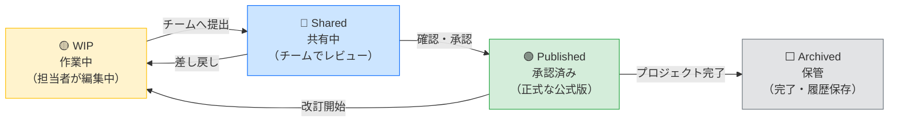
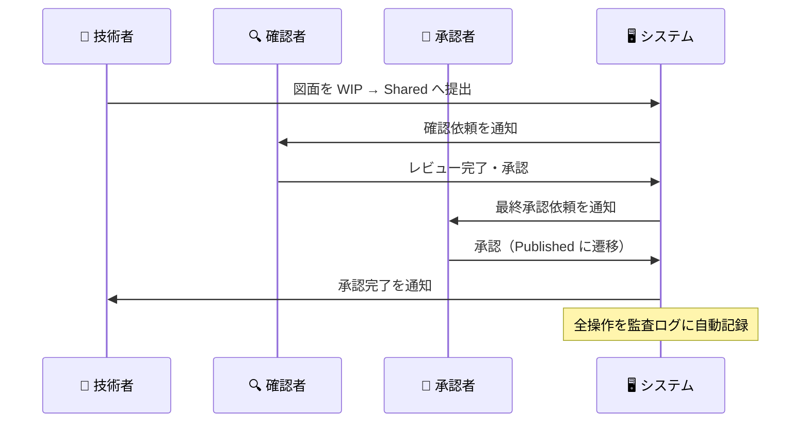

# 🏗️ Open BIM 情報基盤

[](https://github.com/Kensan196948G/Open-BIM-Information-Platform/actions/workflows/ci.yml)
[](https://www.iso.org/standard/68078.html)
[](#-デモを今すぐ体験する)

> **建設・土木プロジェクトの図面・3Dモデル・文書を、国際規格 ISO 19650 に基づいて一元管理する Web プラットフォームです。**
> 紙・メール・共有ドライブによる情報散乱を解消し、承認漏れ・版管理ミスをゼロにします。

---

## 📋 目次

- [このシステムが解決する課題](#-このシステムが解決する課題)
- [主な機能・効果](#-主な機能効果)
- [誰のためのシステムか](#-誰のためのシステムか)
- [情報の流れ（CDE ワークフロー）](#-情報の流れcde-ワークフロー)
- [デモを今すぐ体験する](#-デモを今すぐ体験する)
- [導入・起動方法](#-導入起動方法)
- [準拠規格・法令対応](#-準拠規格法令対応)
- [詳細ドキュメント](#-詳細ドキュメント)

---

## ⚠️ このシステムが解決する課題

| 現場・組織でよくある問題 | 本システムによる解決 |
|---|---|
| 最新の図面がどれか分からない | ✅ 承認済み（Published）状態の図面のみを正式版として管理 |
| 承認ルートが不明確で判子をもらい忘れる | ✅ 承認ワークフローを画面上で一元管理・通知 |
| 誰かが古い図面で施工してしまった | ✅ 状態（WIP/共有/承認済）が常に可視化され、旧版は自動的にアーカイブ |
| 現場・本社・設計事務所で情報が分散している | ✅ Web ブラウザひとつで全関係者がアクセス |
| 監査時に操作履歴を説明できない | ✅ 誰が・いつ・何を操作したかを自動記録（J-SOX 対応） |
| 図面ファイル名がバラバラで管理できない | ✅ ISO 19650 命名規則を自動チェック・違反を即検出 |

---

## ✅ 主な機能・効果

```
📁 情報コンテナ管理   → 図面・モデル・文書を統一ルールで一元登録
🔄 承認ワークフロー   → 作業中 → 共有 → 承認済 → 保管 の状態管理
📛 命名規則チェック   → ISO 19650 準拠。不適合ファイルを即時検出
🔐 アクセス権限管理   → 公開・限定・機密・制限付き の4段階セキュリティ
📊 ダッシュボード     → プロジェクト全体の進捗・承認待ち件数を可視化
📋 監査証跡           → 全操作を自動記録（いつ・誰が・何を）
🏷️ 要求文書管理       → EIR（情報要求）・BEP（BIM実行計画）を管理
```

---

## 👥 誰のためのシステムか

### 🏢 本社・支店 管理部門の方へ

- 全プロジェクトの承認状況・情報提供状況をダッシュボードで一覧確認できます
- 進捗の遅れ・承認待ちが滞っているプロジェクトを即座に把握できます
- 現場への問い合わせを減らし、管理業務を効率化できます

### 👷 現場施工管理者の方へ

- 最新版の図面・施工モデルを常にブラウザから確認できます
- 承認リクエストの提出・確認を画面上で完結できます
- 旧版を誤って使うリスクがなくなります

### 🔬 土木・建設 技術者・研究者の方へ

- BIM モデル（IFC 形式）・BCF 指摘情報を一元管理できます
- ISO 19650 Annex A 準拠の命名規則に基づき、自動的にファイルを分類・検証します
- 複数プロジェクトをまたいで情報を検索・比較できます

### 👔 経営役員の方へ

- 全プロジェクトの健全性（情報提供率・承認完了率・命名規則適合率）を一画面で確認できます
- プロジェクトリスクを早期に発見し、経営判断の根拠を数値で示せます
- 情報管理体制を対外的に証明できます（ISO 19650 準拠）

### 🔍 監査法人の方へ

- 全操作の履歴（誰が・いつ・何を・どう変えたか）を追跡できます
- J-SOX / ISO 20000 / ISO 27001 対応の監査証跡ログを提供します
- 情報の改ざん・削除があった場合も記録上に残ります

---

## 🔄 情報の流れ（CDE ワークフロー）

ISO 19650 が定める「コモン・データ・エンバイロンメント（CDE）」の状態管理です。
図面・モデルは以下の4つの状態を経て、正式な成果物として登録されます。



### 承認フロー（例）



---

## 🎯 デモを今すぐ体験する

**バックエンドサーバー・データベース不要**で、ブラウザですぐに操作を確認できます。

### 起動手順（IT部門が実施）

```bash
# ① リポジトリを取得後、プロジェクトフォルダで実行
./scripts/start.sh demo

# 起動後、画面に表示されるアドレス（例: http://192.168.x.x:3000）をブラウザで開く
```

> IT部門向けの詳細セットアップ手順は → [📘 IT_SETUP.md](docs/IT_SETUP.md)

### デモ用ログイン情報

| 項目 | 内容 |
|---|---|
| メールアドレス | `demo@example.com` |
| パスワード | `pass1234` |

### デモで確認できるデータ

| 画面 | 収録データ |
|---|---|
| 📊 **ダッシュボード** | 10プロジェクト・承認待ち30件 |
| 📁 **プロジェクト一覧** | 北陸新幹線延伸・羽田T4・首都高湾岸 など実案件規模のサンプル |
| 📄 **情報コンテナ** | 113件（図面・3Dモデル・IFC・BCF・仕様書） |
| ✅ **承認ワークフロー** | 30件の承認フロー（申請中・差し戻し・承認済） |
| 📋 **監査ログ** | 55件の操作履歴（ログイン・提出・承認・命名違反など） |
| 🏷️ **命名規則設定** | ISO 19650 Annex A 準拠の7セグメント自動検証 |

---

## 🚀 導入・起動方法

> 詳細な手順・サーバー設定は → [📘 IT_SETUP.md](docs/IT_SETUP.md)

### システム要件

| 要件 | 内容 |
|---|---|
| OS | Linux / macOS / Windows (WSL2) |
| ソフトウェア | Docker Desktop（無料） |
| ネットワーク | 社内 LAN または VPN |
| ブラウザ | Chrome / Edge / Firefox（最新版） |

### デモモード（モックデータ・即起動）

```bash
./scripts/start.sh demo
```

起動後にターミナルに表示される URL（例: `http://192.168.1.10:3000`）をブラウザで開いてください。

### 本番モード（フルスタック）

```bash
./scripts/start.sh
```

### OS 起動時に自動起動（推奨）

一度設定するだけで、サーバー再起動後も自動的にサービスが立ち上がります。

```bash
# 管理者権限で実行（IT部門が実施）
sudo ./scripts/install-service.sh demo    # デモモード
sudo ./scripts/install-service.sh full    # 本番モード
```

---

## 📐 準拠規格・法令対応

| 規格・制度 | 対応内容 |
|---|---|
| **ISO 19650-2:2018** | 情報コンテナ管理・CDE ワークフロー・命名規則 |
| **ISO 19650-3:2020** | 竣工・維持管理フェーズの資産情報管理 |
| **J-SOX（金融商品取引法）** | 操作履歴の自動記録・改ざん防止設計 |
| **ISO 27001** | 情報セキュリティ管理（アクセス制御・機密区分） |
| **IFC 4.x / BCF 2.1** | 国際 BIM データ形式に対応 |

---

## 📚 詳細ドキュメント

| 対象者 | ドキュメント | 内容 |
|---|---|---|
| 💻 **IT部門・システム管理者** | [📘 IT_SETUP.md](docs/IT_SETUP.md) | インストール・Docker設定・ネットワーク設定・systemd登録 |
| 🔧 **開発者・エンジニア** | [⚙️ TECH_STACK.md](docs/TECH_STACK.md) | 技術スタック・API仕様・アーキテクチャ図 |
| 📐 **BIM管理者・技術者** | [📐 BIM_GUIDE.md](docs/BIM_GUIDE.md) | ISO 19650 準拠ガイド・命名規則設定方法 |

---

## 📊 品質・システム状態

| 指標 | 状態 |
|---|---|
| 🔧 CI/CD パイプライン | ✅ 全7ジョブ通過 |
| 🧪 自動テスト | ✅ バックエンド 35件 ＋ フロントエンド 8件 ＋ E2E 9件 |
| 🔐 セキュリティ | ✅ Critical/High 0件 |
| 📛 命名規則適合率 | 94%（デモデータ） |

---

*ISO 19650-2:2018 / ISO 19650-3:2020 準拠 ｜ J-SOX 監査証跡対応 ｜ IFC 4.x / BCF 2.1 対応*
