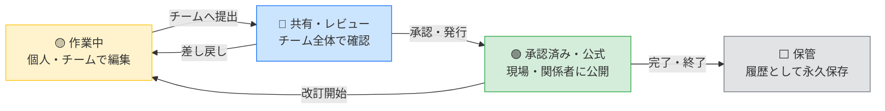

# Open BIM 情報基盤

> 建設・土木プロジェクトの図面・モデル・文書を、国際規格に基づいて安全に一元管理するシステムです。

---

## このシステムについて

建設・土木プロジェクトでは、図面・モデル・設計文書が大量に生まれます。
版違いの図面を使い続けた、誰かが勝手にファイルを上書きした、誰が承認したか分からない——
そうした現場の混乱を防ぐために開発されたシステムです。

国際規格 **ISO 19650**（BIM 情報管理の国際標準）に基づき、**情報の登録・承認・公開・保管**を
一つの流れとして管理します。すべての操作は自動的に記録され、後から検索・確認できます。

---

## どんな課題を解決するか

| よくある現場の困りごと | このシステムでの解決 |
|---|---|
| 最新の図面がどれか分からない | 「承認済み」状態の図面だけが現場に届く仕組み |
| 古い版を誰かが間違って使った | 版管理と状態管理で「作業中／公式／保管」を明確に区別 |
| 承認のやり取りがメールで埋もれる | 承認ワークフローをシステム上で完結・追跡可能 |
| 監査で「誰がいつ承認したか」を問われる | すべての操作が自動記録（消去・改ざん不可） |
| 社内外でファイルの共有ルールがバラバラ | 命名規則を自動チェック、不適合を即座に検出 |

---

## 主な機能

### 情報の流れ（コモン・データ・エンバイロンメント）

すべての図面・文書はこの4段階の状態を経て管理されます。
「作業中」のファイルが誤って現場に届くことはありません。

---

### 主な機能一覧

**情報管理**
- 図面・BIM モデル・文書を統一ルールで登録・管理
- ISO 19650 に準拠した命名規則の自動チェック（不適合を即検出）
- 版管理（改訂履歴をすべて保存）

**承認・ワークフロー**
- 担当者→承認者→公開 の承認フローをシステム上で管理
- 承認待ち・差し戻し・完了の状態をリアルタイムで確認

**情報セキュリティ**
- 公開 / 限定 / 機密 / 制限付き の4段階のアクセス区分
- 組織・プロジェクトごとのアクセス権限設定

**監査・証跡**
- 誰が・いつ・何を操作したかを自動記録
- 記録の消去・改ざんは技術的に不可能な設計
- J-SOX 対応・監査法人による確認に対応

**ダッシュボード**
- 全プロジェクトの承認状況・進捗を一覧表示
- 承認待ち件数・未対応アラートを可視化

---

## 利用者ごとの使い方

### 現場施工管理者

最新の承認済み図面・施工モデルを確認します。
現場に届く情報は「承認済み」状態のものだけです。差し戻された図面や作業中のデータは表示されません。

### 設計・土木建設技術者

担当する成果物を登録し、チームへ共有・承認申請を行います。
命名規則のチェックはシステムが自動で行うため、規則の暗記は不要です。

### 本社・支店の管理部門

ダッシュボードから全プロジェクトの承認状況・進捗を確認します。
承認待ちが滞留している案件を早期に把握し、対応を促すことができます。

### 経営役員

全プロジェクトの健全性をダッシュボードで一覧確認します。
リスクのある案件（承認遅延・規則違反）がアラートで表示されます。

### 監査法人・内部監査担当

監査証跡ログから、特定のプロジェクト・期間・操作者を絞り込んで確認できます。
すべての記録は改ざん不可能な形式で保存されています。

---

## 準拠規格・セキュリティ

| 項目 | 内容 |
|---|---|
| 情報管理規格 | ISO 19650-1/2 （BIM情報管理の国際標準） |
| 命名規則 | ISO 19650 Annex A（7セグメント命名方式） |
| セキュリティ設計 | J-SOX 対応・監査証跡 Append-Only 設計 |
| アクセス管理 | ロールベースのアクセス制御（RBAC） |
| パスワード | 業界標準の暗号化（bcrypt）を使用 |

---

## システム導入・運用について

本システムの導入・設置・日常運用はIT部門が担当します。
詳しくは各担当者向けドキュメントをご参照ください。

| 対象 | ドキュメント |
|---|---|
| 💻 IT部門スタッフ（導入・運用担当） | [IT部門向けガイド](docs/IT_SETUP.md) |
| 🔧 開発・保守担当エンジニア | [技術スタック詳細](docs/TECH_STACK.md) |
| 🏗️ BIM管理者・設計担当 | [アーキテクチャ設計書](docs/ARCHITECTURE.md) |

---

## よくある質問

**Q. 使うためにBIMの専門知識は必要ですか？**
A. 日常操作（図面の確認・承認申請）に専門知識は不要です。命名規則のチェックはシステムが自動で行います。

**Q. スマートフォンやタブレットでも使えますか？**
A. Webブラウザがあれば端末を問わず利用できます。現場でのタブレット利用を想定した設計です。

**Q. 既存のファイルサーバーと併用できますか？**
A. 移行計画についてはIT部門またはシステム担当者にご相談ください。

**Q. 監査証跡はいつまで保存されますか？**
A. 保存期間の設定はシステム管理者が行います。記録は消去・改ざんが技術的に不可能な設計です。

---

*ISO 19650-2:2018 準拠 · 監査証跡対応 · J-SOX 対応設計*
