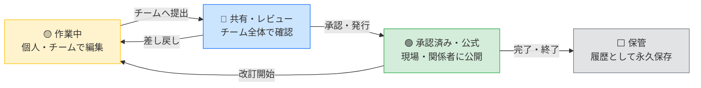

# Open BIM 情報基盤

> 建設・土木プロジェクトの図面・モデル・文書を、国際規格に基づいて安全に一元管理するシステムです。

 

---

## このシステムについて

建設・土木プロジェクトでは、図面・モデル・設計文書が大量に生まれます。
版違いの図面を使い続けた、誰かが勝手にファイルを上書きした、誰が承認したか分からない——
そうした現場の混乱を防ぐために開発されたシステムです。

国際規格 **ISO 19650**（BIM 情報管理の国際標準）の考え方に基づき、**情報の登録・承認・公開・保管**を
一つの流れとして管理することを目指したシステムです（**準拠支援・設計目標であり、第三者による
適合性評価・認証は未取得**です）。主要な操作は監査ログに記録され、後から検索・確認できます。

---

## どんな課題を解決するか

| よくある現場の困りごと | このシステムでの解決 |
|---|---|
| 最新の図面がどれか分からない | 「承認済み」状態の図面だけが現場に届く仕組み |
| 古い版を誰かが間違って使った | 版管理と状態管理で「作業中／公式／保管」を明確に区別 |
| 承認のやり取りがメールで埋もれる | 承認ワークフローをシステム上で完結・追跡可能 |
| 監査で「誰がいつ承認したか」を問われる | 主要な操作を自動記録し、監査ログとして参照可能 |
| 社内外でファイルの共有ルールがバラバラ | 命名規則を自動チェック、不適合を即座に検出 |

---

## 主な機能

### 情報の流れ（コモン・データ・エンバイロンメント）

すべての図面・文書はこの4段階の状態を経て管理されます。
「作業中」のファイルが誤って現場に届くことはありません。

---

### 主な機能一覧

**情報管理**
- 図面・BIM モデル・文書を統一ルールで登録・管理
- ISO 19650 に準拠した命名規則の自動チェック（不適合を即検出）
- 版管理（改訂履歴をすべて保存）

**承認・ワークフロー**
- 担当者→承認者→公開 の承認フローをシステム上で管理
- 承認待ち・差し戻し・完了の状態をリアルタイムで確認

**情報セキュリティ**
- 公開 / 限定 / 機密 / 制限付き の4段階のアクセス区分
- 組織・プロジェクトごとのアクセス権限設定

**監査・証跡**
- 誰が・いつ・何を操作したかを主要操作について自動記録
- 監査ログは追加専用（Append-Only）設計。DBトリガーによる更新・削除拒否を実装
- 外部WORM・電子署名等の完全性保証は未実装（今後整備予定）
- J-SOX 対応は設計目標。ITGC・職務分掌・統制評価の整備は今後実施（未認証）

**ダッシュボード**
- 全プロジェクトの承認状況・進捗を一覧表示
- 承認待ち件数・未対応アラートを可視化

---

## 利用者ごとの使い方

### 現場施工管理者

最新の承認済み図面・施工モデルを確認します。
現場に届く情報は「承認済み」状態のものだけです。差し戻された図面や作業中のデータは表示されません。

### 設計・土木建設技術者

担当する成果物を登録し、チームへ共有・承認申請を行います。
命名規則のチェックはシステムが自動で行うため、規則の暗記は不要です。

### 本社・支店の管理部門

ダッシュボードから全プロジェクトの承認状況・進捗を確認します。
承認待ちが滞留している案件を早期に把握し、対応を促すことができます。

### 経営役員

全プロジェクトの健全性をダッシュボードで一覧確認します。
リスクのある案件（承認遅延・規則違反）がアラートで表示されます。

### 監査法人・内部監査担当

監査証跡ログから、特定のプロジェクト・期間・操作者を絞り込んで確認できます。
監査ログは追加専用の形式で保存され、DBトリガーにより更新・削除が拒否されます。
第三者による完全性保証（WORM・署名・時刻証明）は今後整備予定です。

---

## 準拠規格・セキュリティ

| 項目 | 内容 |
|---|---|
| 情報管理規格 | ISO 19650-1/2 （設計参考・準拠支援。第三者認証は未取得） |
| 命名規則 | ISO 19650 Annex A（7セグメント命名方式） |
| セキュリティ設計 | 監査証跡 Append-Only 設計（J-SOX 対応は設計目標・未認証） |
| アクセス管理 | ロールベースのアクセス制御（RBAC） |
| パスワード | 業界標準の暗号化（bcrypt）を使用 |

---

## システム導入・運用について

本システムの導入・設置・日常運用はIT部門が担当します。
詳しくは各担当者向けドキュメントをご参照ください。

| 対象 | ドキュメント |
|---|---|
| 💻 IT部門スタッフ（導入・運用担当） | [IT部門向けガイド](docs/IT_SETUP.md) |
| 🔧 開発・保守担当エンジニア | [技術スタック詳細](docs/TECH_STACK.md) |
| 🏗️ BIM管理者・設計担当 | [アーキテクチャ設計書](docs/ARCHITECTURE.md) |
| 🚨 障害対応 | [インシデント対応 Runbook](docs/INCIDENT_RUNBOOK.md) |
| 📈 監視・SLO | [SLI/SLO・アラート方針](docs/SLI_SLO.md) |
| 💾 バックアップ・復元 | [バックアップ/復元ガイド](docs/BACKUP_RESTORE.md) |
| 🗓️ 定期点検 | [運用台帳](docs/OPS_LEDGER.md)・[定期保守手順](docs/MAINTENANCE.md) |
| 🚀 本番デプロイ | [本番デプロイ Runbook](docs/PRODUCTION_DEPLOYMENT.md) |

---

## 開発状況（2026-08-05）

- **現在地**: 機能PoC〜限定パイロット準備段階。**本番運用の正本としては未到達**です。
- 第三者の適合性評価・認証（ISO 19650 / J-SOX / 監査）は**未取得**です。
- 本番展開には、Phase 0（起動ガード・TLS・監査証跡・PostgreSQL試験・バックアップ等）と
  限定パイロット（2案件・30〜50名）の完了を前提としています。
- 本番環境（ドメイン・ホスト・Secrets・監視先）は未確定のため、本番デプロイは未実施です。
  コード・検証・運用手順の準備は完了しており、環境確定後に段階的デプロイを実施します。

## 外部評価・改善（2026-08-12）

- 18 指標の統合評価と競合比較を実施しました（[評価報告書](docs/EVALUATION_REPORT.md)）。
- 重大問題（クロス組織のコンテナ更新 IDOR・主要画面のモック表示・承認/アップロード未接続）を
  修正し、ファイル一覧/削除・承認タスク API・監査 CSV・ユーザー管理 API・メトリクスを追加しました
  （[改善ログ](docs/IMPROVEMENT_LOG_2026-08-12.md)）。
- 本番化には RBAC 権限強制・通知・検索・本番環境提供（Issue #31）が残っています。

---

## よくある質問

**Q. 使うためにBIMの専門知識は必要ですか？**
A. 日常操作（図面の確認・承認申請）に専門知識は不要です。命名規則のチェックはシステムが自動で行います。

**Q. スマートフォンやタブレットでも使えますか？**
A. Webブラウザがあれば端末を問わず利用できます。現場でのタブレット利用を想定した設計です。

**Q. 既存のファイルサーバーと併用できますか？**
A. 移行計画についてはIT部門またはシステム担当者にご相談ください。

**Q. 監査証跡はいつまで保存されますか？**
A. 保存期間の設定はシステム管理者が行います。監査ログは追加専用設計で、DBトリガーにより
更新・削除が拒否されます。第三者による消去・改ざん防止（WORM等）は今後整備予定です。

---

*ISO 19650-2:2018 準拠支援（未認証） · 監査証跡 Append-Only 設計 · J-SOX 対応は設計目標*
