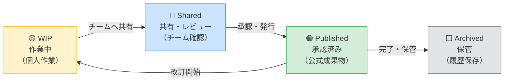

# 🏗️ Open BIM 情報基盤

[](https://github.com/Kensan196948G/Open-BIM-Information-Platform/actions/workflows/ci.yml)
[](https://www.iso.org/standard/68078.html)
[](#-デモ体験)

> **建設・土木プロジェクトの図面・モデル・文書を、国際規格 ISO 19650 に基づいて一元管理する Web プラットフォームです。**

---

## 📋 目次

- [このシステムでできること](#-このシステムでできること)
- [誰が使うシステムか](#-誰が使うシステムか)
- [情報フロー（CDE ワークフロー）](#-情報フローcde-ワークフロー)
- [デモ体験](#-デモ体験)
- [クイックスタート](#-クイックスタート)
- [詳細ドキュメント](#-詳細ドキュメント)

---

## ✅ このシステムでできること

| 機能 | 説明 |
|---|---|
| 📁 **情報コンテナ管理** | 図面・モデル・文書を統一ルールで登録・管理 |
| 🔄 **承認ワークフロー** | 作業中 → 共有 → 承認済 → 保管 の状態遷移を管理 |
| 📛 **命名規則チェック** | ISO 19650 準拠の命名規則を自動検証（不適合を即検出） |
| 👥 **アクセス権限管理** | 公開・限定・機密・制限付き の4段階セキュリティ |
| 📊 **ダッシュボード** | プロジェクト全体の進捗・承認待ち・状態を可視化 |
| 📋 **監査証跡** | 誰が・いつ・何を操作したかを自動記録（監査法人対応） |
| 🏷️ **要求文書管理** | EIR（雇用主情報要求）・BEP（BIM 実行計画）を管理 |

---

## 👥 誰が使うシステムか

```
本社・支店の管理部門
  └── プロジェクトの進捗確認、承認状況の把握

現場施工管理者
  └── 図面・施工モデルの最新版確認、承認リクエスト

土木・建設技術者
  └── 情報コンテナへの登録・更新、命名規則に従った管理

経営役員
  └── ダッシュボードで全プロジェクトの健全性を一覧確認

監査法人
  └── 監査証跡ログで操作履歴を確認（J-SOX 対応）
```

---

## 🔄 情報フロー（CDE ワークフロー）

ISO 19650 に定める「コモン・データ・エンバイロンメント（CDE）」の状態遷移：



---

## 🎯 デモ体験

バックエンドサーバー不要で、すぐに画面を確認できます。

### ブラウザで即起動（推奨）

```bash
# リポジトリをクローン後
cd Open-BIM-Information-Platform

# デモ起動
./scripts/start.sh demo
```

ブラウザで `http://192.168.0.185:3000` を開いてください。

```
🔑 ログイン情報
  メール:     demo@example.com
  パスワード: pass1234
```

### デモ画面で確認できること

| 画面 | 内容 |
|---|---|
| 📊 ダッシュボード | 5プロジェクト・48件のコンテナ・承認待ち10件 |
| 📁 プロジェクト一覧 | 東京・大阪・名古屋等の実案件風データ |
| 📄 情報コンテナ | CDE状態・命名規則適合率・セキュリティ区分 |
| 📋 監査ログ | 操作履歴20件のサンプル |
| 🏷️ 命名規則設定 | ISO 19650 Annex A 準拠の7セグメント設定 |

---

## 🚀 クイックスタート

### 前提条件

- Docker および Docker Compose がインストール済み
- ネットワーク接続（初回のみ）

### デモモード（モックデータ）

```bash
# 起動
./scripts/start.sh demo

# 停止
docker compose -f docker-compose.demo.yml down
```

### 本番モード（フルスタック）

```bash
# 環境変数ファイルを準備
cp .env.example .env
# .env の中身を適切に設定

# 起動
./scripts/start.sh

# 停止
docker compose down
```

### OS 起動時に自動起動（systemd 登録）

```bash
# 管理者権限で実行
sudo ./scripts/install-service.sh demo    # デモモード
sudo ./scripts/install-service.sh full    # 本番モード
```

---

## 📚 詳細ドキュメント

| 対象 | ドキュメント |
|---|---|
| 💻 IT部門・システム管理者 | [セットアップ・運用ガイド](docs/IT_SETUP.md) |
| 🔧 開発者・エンジニア | [技術スタック詳細](docs/TECH_STACK.md) |
| 📐 BIM管理者 | [ISO 19650 準拠ガイド](docs/BIM_GUIDE.md) |

---

## 📊 システム状態

| 項目 | 状態 |
|---|---|
| CI/CD | ✅ 全7ジョブ通過 |
| テスト | ✅ 35 backend + 8 frontend + 9 E2E |
| セキュリティ | ✅ Critical/High 0件 |
| 命名規則適合率 | 94% |

---

*ISO 19650-2:2018 準拠 · 監査証跡対応 · J-SOX 対応設計*
