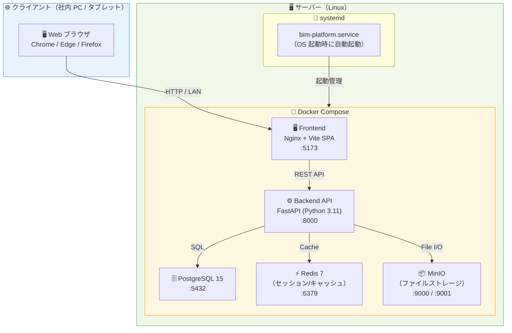
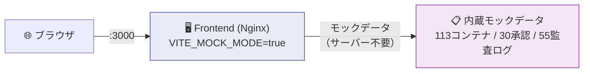
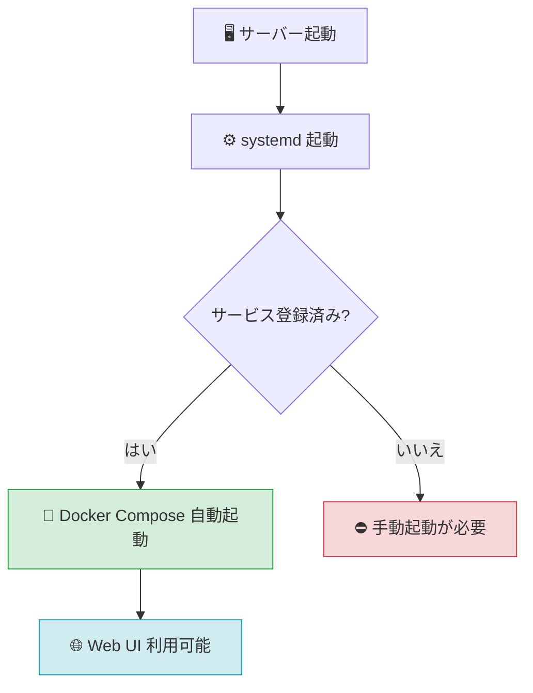
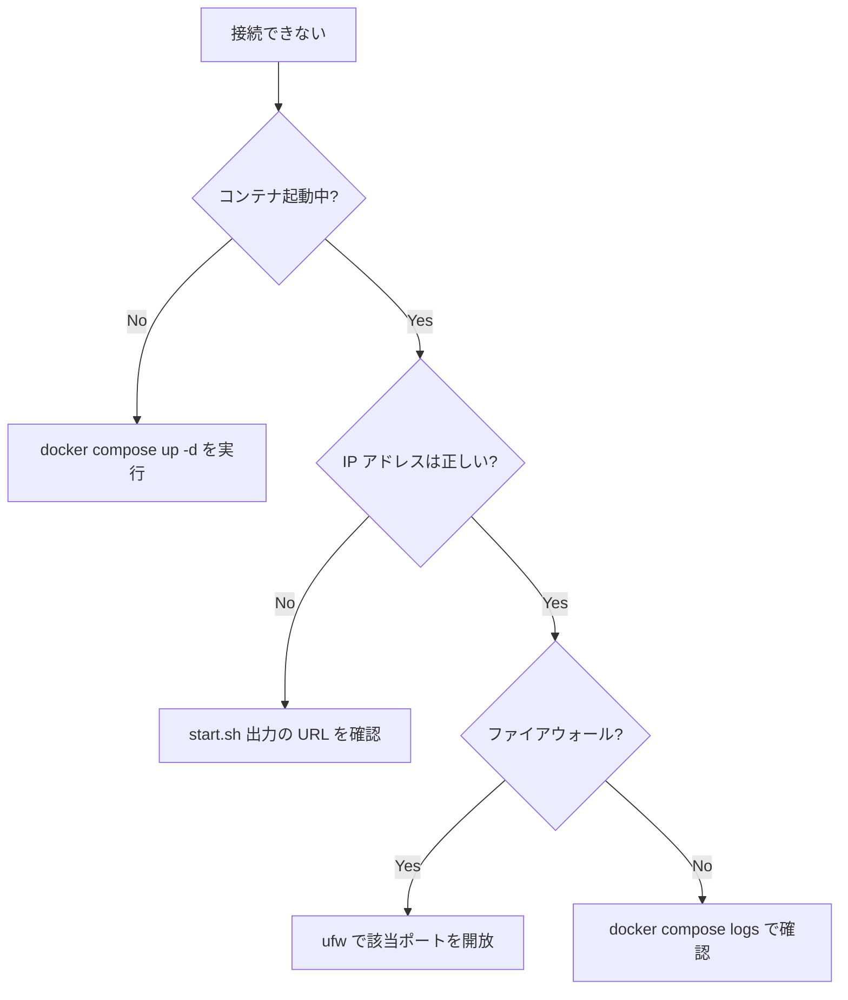

# 📘 IT 部門向け セットアップ・運用ガイド

> Open BIM 情報基盤のインストール・起動・保守を担当する **IT スタッフ・システム管理者** 向けの技術ガイドです。
> エンドユーザー向けの概要は → [README.md](../README.md)

---

## 📋 目次

- [システム構成・アーキテクチャ](#-システム構成アーキテクチャ)
- [動作要件](#-動作要件)
- [インストール手順](#-インストール手順)
- [起動・停止](#-起動停止)
- [自動起動（systemd 登録）](#-自動起動systemd-登録)
- [ポート一覧](#-ポート一覧)
- [ログ確認](#-ログ確認)
- [バックアップ・リストア](#-バックアップリストア)
- [セキュリティ設定](#-セキュリティ設定)
- [トラブルシューティング](#-トラブルシューティング)
- [エスカレーション先](#-エスカレーション先)

---

## 🏗️ システム構成・アーキテクチャ

### 全体構成図（本番モード）



### デモモード構成図（バックエンド不要）



---

## ✅ 動作要件

### ハードウェア要件

| 項目 | デモモード | 本番モード |
|---|---|---|
| **CPU** | 1コア以上 | 2コア以上（推奨4コア） |
| **メモリ** | 1GB 以上 | 4GB 以上（推奨 8GB） |
| **ディスク** | 5GB 以上 | 50GB 以上（ファイル容量別途） |

### ソフトウェア要件

| ソフトウェア | バージョン | 確認コマンド |
|---|---|---|
| **OS** | Ubuntu 22.04 LTS / Debian 12 | `lsb_release -a` |
| **Docker Engine** | 24.0 以上 | `docker --version` |
| **Docker Compose** | v2.20 以上 | `docker compose version` |
| **Git** | 2.0 以上 | `git --version` |

### ネットワーク要件

| 項目 | 要件 |
|---|---|
| LAN 接続 | 必須（ブラウザアクセス用） |
| IP アドレス | 固定 IP 推奨（DHCP 可、ただしブックマーク変動に注意） |
| インターネット | 初回インストール時のみ（以降はオフライン可） |
| ファイアウォール | 3000番（デモ）/ 5173番（本番）を LAN 内で開放 |

---

## 📥 インストール手順

### ステップ 1: Docker のインストール

```bash
# Ubuntu / Debian 向け（公式スクリプト）
curl -fsSL https://get.docker.com | sh

# 実行ユーザーを docker グループに追加（sudo なし実行のため）
sudo usermod -aG docker $USER
newgrp docker

# インストール確認
docker --version
docker compose version
```

### ステップ 2: リポジトリ取得

```bash
git clone https://github.com/Kensan196948G/Open-BIM-Information-Platform.git
cd Open-BIM-Information-Platform
```

### ステップ 3: 環境変数設定（本番モードのみ）

```bash
cp .env.example .env
nano .env
```

**必ず変更が必要な項目:**

```env
# データベース（必須）
POSTGRES_PASSWORD=必ず強力なパスワードに変更

# セッション署名鍵（必須・64文字以上のランダム文字列）
SECRET_KEY=xxxxxxxxxxxxxxxxxxxxxxxxxxxxxxxxxxxxxxxxxxxxxxxxxxxxxxxxxxxxxxxx

# ファイルストレージ（必須）
MINIO_ROOT_PASSWORD=必ず強力なパスワードに変更
```

> ⚠️ `.env` ファイルは**絶対に Git にコミットしない**こと（`.gitignore` で除外済み）

### ステップ 4: 動作確認（デモモード）

```bash
./scripts/start.sh demo
```

起動後、ターミナルに表示される URL をブラウザで開いて動作確認してください。
（自動的に空きポートを検出します。例: `http://192.168.1.10:3000`）

---

## ▶️ 起動・停止

### 起動

```bash
# デモモード（モックデータ・バックエンド不要）
./scripts/start.sh demo

# 本番モード（フルスタック）
./scripts/start.sh
```

起動時にターミナルへ以下が表示されます。

```
✅ Open BIM プラットフォームが起動しました

  🌐 WebUI:       http://192.168.1.10:5173
  🔧 API:         http://192.168.1.10:8000/api/v1
  📊 API Docs:    http://192.168.1.10:8000/docs
```

### 停止

```bash
# デモモードの停止
docker compose -f docker-compose.demo.yml down

# 本番モードの停止
docker compose down
```

---

## 🔧 自動起動（systemd 登録）

OS（サーバー）を再起動した後、自動的にサービスが立ち上がるように設定します。

### 登録フロー



### 登録手順

```bash
# デモモード（推奨: 社内デモ・体験用）
sudo ./scripts/install-service.sh demo

# 本番モード
sudo ./scripts/install-service.sh full
```

### systemd による管理コマンド

```bash
# 状態確認
systemctl status bim-platform-demo    # デモモード
systemctl status bim-platform         # 本番モード

# 起動 / 停止 / 再起動
systemctl start   bim-platform-demo
systemctl stop    bim-platform-demo
systemctl restart bim-platform-demo

# ログをリアルタイム確認
journalctl -u bim-platform-demo -f
```

---

## 🔌 ポート一覧

| ポート | サービス | 用途 | 外部公開 |
|---|---|---|---|
| `3000` | デモ WebUI | モックデータ操作画面 | ✅ LAN 内 |
| `5173` | 本番 WebUI | 通常操作画面 | ✅ LAN 内 |
| `8000` | Backend API | REST API + Swagger UI | ⚠️ 内部推奨 |
| `5432` | PostgreSQL | データベース | ❌ 非公開必須 |
| `6379` | Redis | セッション・キャッシュ | ❌ 非公開必須 |
| `9000` | MinIO API | ファイルストレージ | ❌ 非公開必須 |
| `9001` | MinIO Console | ストレージ管理画面 | ⚠️ 管理者のみ |

> ⚠️ インターネット公開時は **nginx リバースプロキシ + TLS（HTTPS）** を必ず設定してください。

### ファイアウォール設定例（UFW）

```bash
# LAN 内のみ WebUI アクセスを許可（本番モード）
sudo ufw allow from 192.168.0.0/16 to any port 5173
sudo ufw allow from 192.168.0.0/16 to any port 3000

# 外部には絶対に開かない
# sudo ufw deny 5432    # PostgreSQL は開けない
# sudo ufw deny 6379    # Redis は開けない
```

---

## 📋 ログ確認

### コンテナのログ

```bash
# 全サービスのログ（リアルタイム）
docker compose logs -f

# サービス別
docker compose logs -f frontend
docker compose logs -f backend
docker compose logs -f postgres

# 直近100行を表示
docker compose logs --tail=100 backend
```

### systemd のログ

```bash
# リアルタイム
journalctl -u bim-platform -f

# 本日分
journalctl -u bim-platform --since today

# エラーのみ
journalctl -u bim-platform -p err
```

---

## 💾 バックアップ・リストア

### データベース（PostgreSQL）

```bash
# バックアップ（日付付きファイル名）
docker compose exec postgres \
  pg_dump -U bim_user bim_platform > backup_$(date +%Y%m%d_%H%M).sql

# リストア
docker compose exec -T postgres \
  psql -U bim_user bim_platform < backup_YYYYMMDD_HHMM.sql
```

### ファイルストレージ（MinIO）

```bash
# バックアップ
docker run --rm \
  -v bim_minio_data:/data \
  -v $(pwd)/backups:/backup \
  alpine tar czf /backup/minio_$(date +%Y%m%d).tar.gz /data

# リストア
docker run --rm \
  -v bim_minio_data:/data \
  -v $(pwd)/backups:/backup \
  alpine tar xzf /backup/minio_YYYYMMDD.tar.gz -C /
```

### 推奨バックアップスケジュール

| 対象 | 頻度 | 保管期間 |
|---|---|---|
| PostgreSQL | 毎日（深夜） | 30日分 |
| MinIO ファイル | 週次 | 90日分 |
| `.env` 設定ファイル | 変更時 | 暗号化して保管 |

---

## 🔐 セキュリティ設定

### 初期設定チェックリスト

```
✅ .env の POSTGRES_PASSWORD を変更した
✅ .env の SECRET_KEY を64文字以上のランダム文字列に設定した
✅ .env の MINIO_ROOT_PASSWORD を変更した
✅ 5432, 6379, 9000 番ポートを外部から遮断した
✅ WebUI ポート（3000/5173）を社内 LAN のみに制限した
✅ デモ用ログイン情報（demo@example.com / pass1234）を本番環境で削除した
```

### セキュリティ区分（アプリ内設定）

| 区分 | 表示色 | アクセス範囲 |
|---|---|---|
| `public` | 🟢 緑 | 全員閲覧可 |
| `limited` | 🔵 青 | プロジェクト関係者のみ |
| `confidential` | 🟡 黄 | 特定者のみ（承認が必要） |
| `restricted` | 🔴 赤 | 厳格な管理下（監査対象） |

---

## 🔧 トラブルシューティング

### よくある問題と対処法

#### ❌ コンテナが起動しない

```bash
# 状態確認
docker compose ps

# エラーログを確認
docker compose logs --tail=50

# 強制再起動
docker compose down && docker compose up -d
```

#### ❌ ポートが使用中（起動時にエラー）

`./scripts/start.sh` は自動的に空きポートを検出します。それでもエラーが出る場合:

```bash
# 使用中プロセスを確認
ss -tlnp | grep -E '3000|5173|8000'

# 競合プロセスを停止してから再起動
./scripts/start.sh demo
```

#### ❌ ブラウザからアクセスできない



#### ❌ ディスク容量不足

```bash
# Docker の不要データ（イメージ・未使用ネットワーク等）を削除
docker system prune -f

# ⚠️ 以下はデータが消えるため本番環境では実行しないこと
# docker volume prune -f
```

#### ❌ PostgreSQL 接続エラー

```bash
# 接続確認
docker compose exec postgres psql -U bim_user -d bim_platform -c "\conninfo"

# ユーザー一覧確認
docker compose exec postgres psql -U bim_user -c "\du"
```

---

## 📞 エスカレーション先

| 問題種別 | 担当 | 連絡手段 |
|---|---|---|
| アプリケーションバグ・機能不具合 | 開発チーム | [GitHub Issues](https://github.com/Kensan196948G/Open-BIM-Information-Platform/issues) |
| インフラ・ネットワーク | IT部門 インフラ担当 | 社内チケット |
| セキュリティインシデント | セキュリティ担当 | **即時報告**（電話可） |
| 監査対応・ログ提供 | システム管理者 + 監査担当 | 社内手順に従う |

---

*← [README.md（概要）](../README.md) | [⚙️ TECH_STACK.md（技術スタック）](TECH_STACK.md) →*
