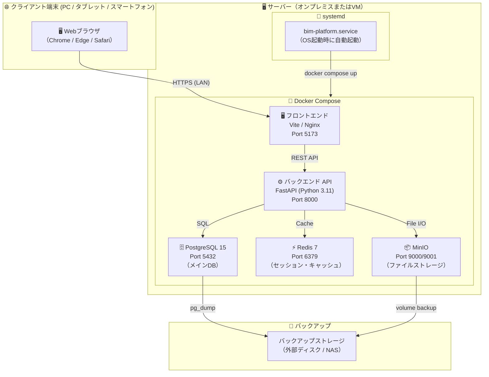
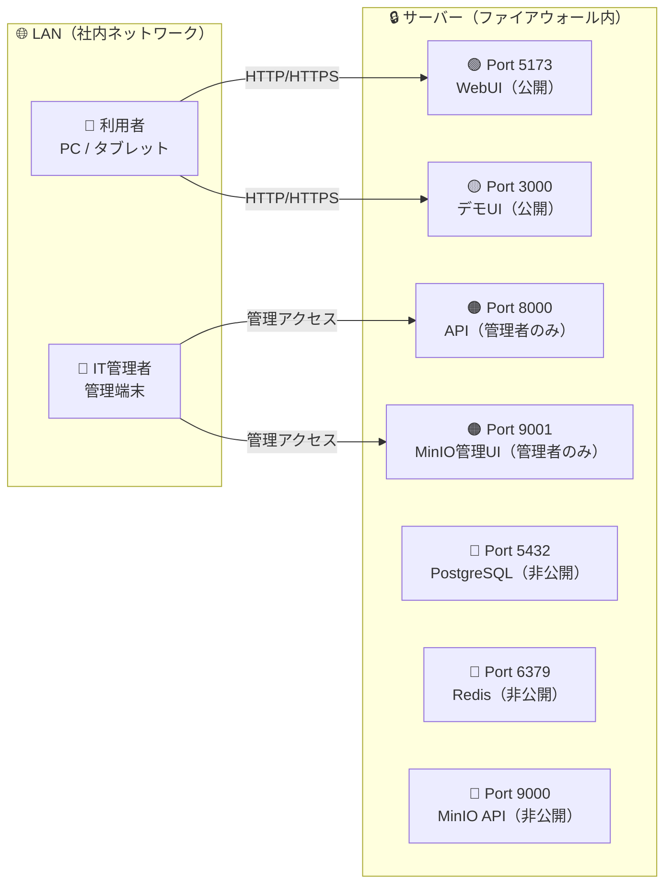
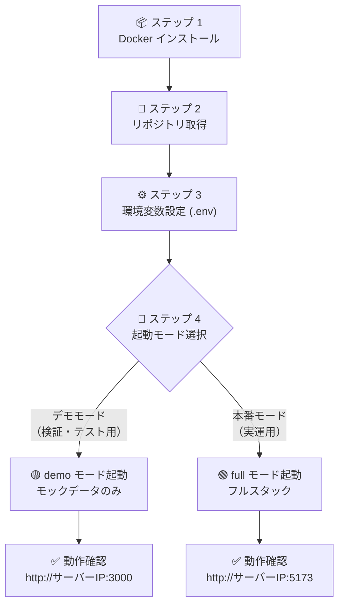
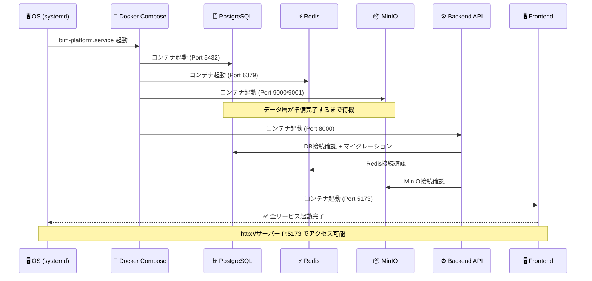
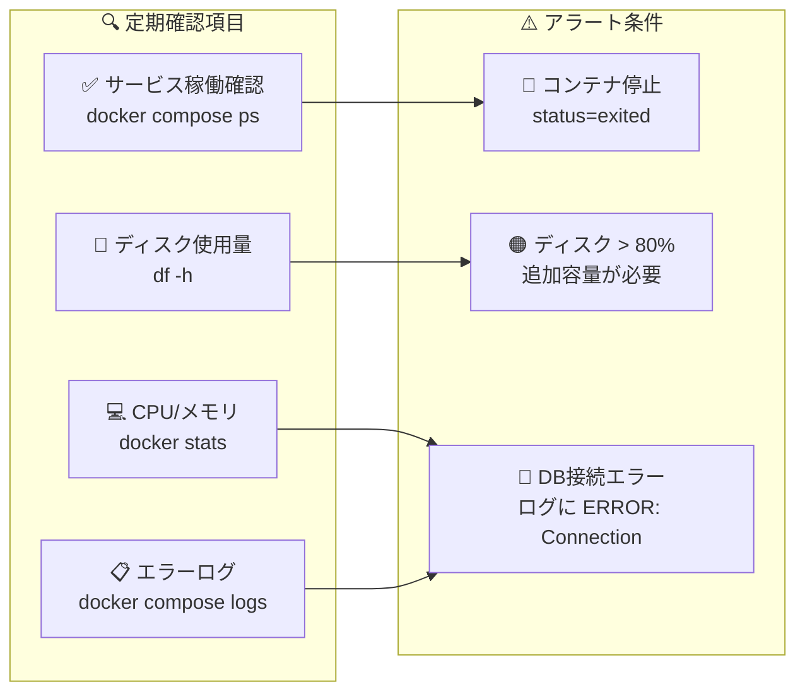
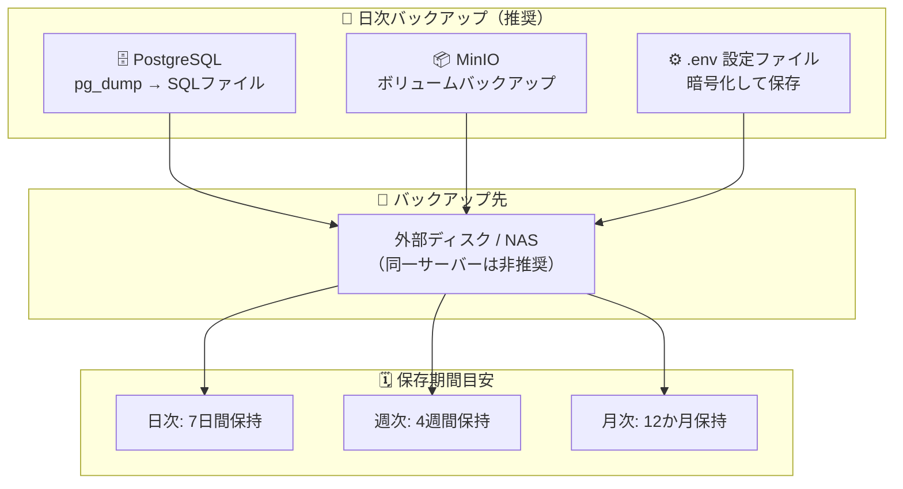
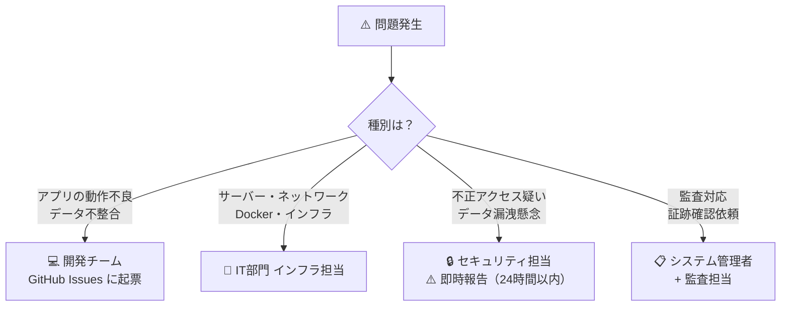

# 💻 IT 部門向け セットアップ・運用ガイド

> Open BIM 情報基盤の**導入・起動・保守・障害対応**を担当する IT スタッフ向けの技術運用ガイドです。

---

## 📋 目次

- [📐 システム全体構成](#-システム全体構成)
- [🌐 ネットワーク・ポート構成](#-ネットワークポート構成)
- [✅ 動作要件](#-動作要件)
- [📥 インストール手順](#-インストール手順)
- [🚀 起動フロー](#-起動フロー)
- [▶️ 起動・停止コマンド](#️-起動停止コマンド)
- [🔍 ヘルスチェック・監視](#-ヘルスチェック監視)
- [📋 ログ管理](#-ログ管理)
- [💾 バックアップ・リストア手順](#-バックアップリストア手順)
- [🔧 トラブルシューティング](#-トラブルシューティング)
- [📞 エスカレーション](#-エスカレーション)

---

## 📐 システム全体構成



---

## 🌐 ネットワーク・ポート構成



| ポート | サービス | 用途 | 外部公開 |
|---|---|---|---|
| `3000` | デモ WebUI | モックデータ確認用UI | 🟢 LAN内公開 |
| `5173` | 本番 WebUI | 通常操作画面 | 🟢 LAN内公開 |
| `8000` | Backend API | REST API + Swagger UI | 🟠 管理者のみ |
| `5432` | PostgreSQL | データベース | 🔴 外部非公開 |
| `6379` | Redis | キャッシュ | 🔴 外部非公開 |
| `9000` | MinIO API | ファイルストレージAPI | 🔴 外部非公開 |
| `9001` | MinIO Console | ストレージ管理UI | 🟠 管理者のみ |

> ⚠️ 外部（インターネット）公開時は **nginx リバースプロキシ + TLS (HTTPS)** を必ず設定してください

---

## ✅ 動作要件

| 項目 | 最小要件 | 推奨 |
|---|---|---|
| 🖥️ OS | Ubuntu 22.04 LTS / Debian 12 以降 | Ubuntu 22.04 LTS |
| 🔢 CPU | 2 コア | 4 コア以上 |
| 💾 メモリ | 4 GB | 8 GB 以上 |
| 💿 ディスク | 20 GB | 100 GB 以上（ファイル保存分含む） |
| 🐳 Docker | 24.0 以上 | 最新安定版 |
| 🔧 Docker Compose | v2.20 以上 | 最新安定版 |
| 🌐 ネットワーク | LAN 接続 | 固定 IP アドレス推奨 |

---

## 📥 インストール手順



### ステップ 1: Docker のインストール

```bash
# Ubuntu/Debian
curl -fsSL https://get.docker.com | sh
sudo usermod -aG docker $USER
newgrp docker
```

### ステップ 2: リポジトリ取得

```bash
git clone https://github.com/Kensan196948G/Open-BIM-Information-Platform.git
cd Open-BIM-Information-Platform
```

### ステップ 3: 環境変数設定

```bash
cp .env.example .env
nano .env   # 各値を編集
```

**⚠️ 必須設定項目（必ず変更すること）:**

| 変数名 | 説明 | 注意 |
|---|---|---|
| `POSTGRES_PASSWORD` | データベースパスワード | 16文字以上の強力なパスワード |
| `SECRET_KEY` | JWT署名キー | ランダム64文字以上 |
| `MINIO_ROOT_PASSWORD` | ストレージ管理パスワード | 16文字以上 |

**任意（本番セキュリティ強化）:**

| 変数名 | 説明 |
|---|---|
| `AV_ENABLED` | `true` でClamAVスキャン有効（本番Composeでは自動設定） |
| `OIDC_ENABLED` / `OIDC_ISSUER` / `OIDC_CLIENT_ID` / `OIDC_CLIENT_SECRET` / `OIDC_REDIRECT_URI` | Entra ID/HENNGE 連携（認可コード+PKCE） |
| `BACKUP_DIR` / `BACKUP_ENCRYPTION_KEY` | バックアップ保存先と暗号鍵（`scripts/backup.sh`） |

### ステップ 4: systemd サービス登録（自動起動設定）

```bash
# デモモード（検証・操作確認用）
sudo ./scripts/install-service.sh demo

# 本番モード（実運用）
sudo ./scripts/install-service.sh full
```

---

## 🚀 起動フロー



---

## ▶️ 起動・停止コマンド

### 手動起動

```bash
# デモモード（モックデータ、バックエンド不要）
./scripts/start.sh demo

# フルスタック（本番）
./scripts/start.sh
```

### systemd による管理

```bash
# 📊 状態確認
systemctl status bim-platform
systemctl status bim-platform-demo

# ▶️ 起動
systemctl start bim-platform

# ⏸️ 停止
systemctl stop bim-platform

# 🔄 再起動
systemctl restart bim-platform

# 🔁 自動起動の有効化
systemctl enable bim-platform

# 🚫 自動起動の無効化
systemctl disable bim-platform
```

### Docker Compose 直接操作

```bash
# 🟢 起動
docker compose up -d

# 🔴 停止
docker compose down

# 🔄 再起動（コンテナのみ、データ保持）
docker compose restart

# 📊 稼働状況確認
docker compose ps
```

---

## 🔍 ヘルスチェック・監視



### API ヘルスチェック

```bash
# バックエンド API の死活確認
curl http://localhost:8000/health

# 正常レスポンス例
# {"status": "ok", "version": "0.1.0", "database": "ok", "redis": "unavailable"}
```

### コンテナ稼働確認

```bash
# 全コンテナの状態一覧
docker compose ps

# リソース使用量（リアルタイム）
docker stats
```

---

## 📋 ログ管理

### ログ確認コマンド

```bash
# 📋 全サービスのログ（リアルタイム）
docker compose logs -f

# 🔎 サービス別ログ
docker compose logs -f backend    # API サーバー
docker compose logs -f postgres   # データベース
docker compose logs -f frontend   # Web サーバー

# 📅 直近 100 行のみ
docker compose logs --tail=100 backend

# 🔧 systemd ログ
journalctl -u bim-platform -f
journalctl -u bim-platform --since "1 hour ago"
```

### ログ出力先

| サービス | ログの場所 |
|---|---|
| 📋 全サービス | `docker compose logs` |
| 🔧 systemd | `journalctl -u bim-platform` |
| 📁 永続ログ | `./logs/` ディレクトリ（マウント設定時） |

---

## 💾 バックアップ・リストア手順



### データベースバックアップ

```bash
# 📤 バックアップ取得
docker compose exec postgres \
  pg_dump -U bim_user bim_platform > backup_$(date +%Y%m%d_%H%M).sql

# ✅ バックアップ確認
ls -lh backup_*.sql
```

### データベースリストア

```bash
# ⚠️ リストア前に必ず既存データのバックアップを取得すること

# 📥 リストア実行
docker compose exec -T postgres \
  psql -U bim_user bim_platform < backup_YYYYMMDD_HHMM.sql
```

### MinIO（ファイルストレージ）バックアップ

```bash
# 📤 バックアップ
docker run --rm \
  -v bim_minio_data:/data \
  -v $(pwd)/backup:/backup \
  alpine tar czf /backup/minio_$(date +%Y%m%d).tar.gz /data

# 📥 リストア
docker run --rm \
  -v bim_minio_data:/data \
  -v $(pwd)/backup:/backup \
  alpine tar xzf /backup/minio_YYYYMMDD.tar.gz -C /
```

---

## 🔧 トラブルシューティング

### 🔴 コンテナが起動しない

```bash
# 1. 状態確認
docker compose ps

# 2. エラーログ確認
docker compose logs

# 3. 再起動
docker compose down && docker compose up -d
```

**よくある原因と対処:**

| 症状 | 原因 | 対処 |
|---|---|---|
| backend が `exited` | DB 接続前に起動 | `docker compose restart backend` |
| postgres が起動しない | ポート競合 or ディスク不足 | `ss -tlnp \| grep 5432` / `df -h` 確認 |
| frontend が 502 | backend 未起動 | backend ログ確認 → 修復後 restart |

### 🟠 ポートが使用中

```bash
# 競合ポートの確認
ss -tlnp | grep -E '5173|8000|3000|5432|6379'

# 競合プロセスの確認
sudo lsof -i :5173
```

### 🟠 ディスク容量不足

```bash
# ディスク使用量確認
df -h

# Docker の不要データ削除（データボリューム以外）
docker system prune -f
docker image prune -f

# ⚠️ 以下はデータが消えるため本番環境では絶対に実行しないこと
# docker volume prune -f   ← 危険: 全データが消える
```

### 🔴 PostgreSQL 接続エラー

```bash
# 接続確認
docker compose exec postgres psql -U bim_user -d bim_platform -c "\conninfo"

# pg_hba.conf / 接続設定確認
docker compose exec postgres cat /var/lib/postgresql/data/pg_hba.conf
```

### 🔴 ログインできない / 認証エラー

```bash
# backend ログで詳細確認
docker compose logs backend | grep -i "error\|auth\|login"

# .env の SECRET_KEY が変更されていないか確認
grep SECRET_KEY .env
```

---

## 📞 エスカレーション



| 問題種別 | 担当 | 連絡方法 |
|---|---|---|
| 💻 アプリケーションバグ | 開発チーム | GitHub Issues |
| 🔧 インフラ・ネットワーク | IT部門インフラ担当 | 社内チケット |
| 🔒 セキュリティインシデント | セキュリティ担当 | **即時電話 + 書面報告** |
| 📋 監査対応 | システム管理者 + 監査担当 | 社内チケット |

---

*📖 関連ドキュメント: [README（非エンジニア向け）](../README.md) ｜ [技術スタック詳細](TECH_STACK.md) ｜ [アーキテクチャ設計書](ARCHITECTURE.md)*
