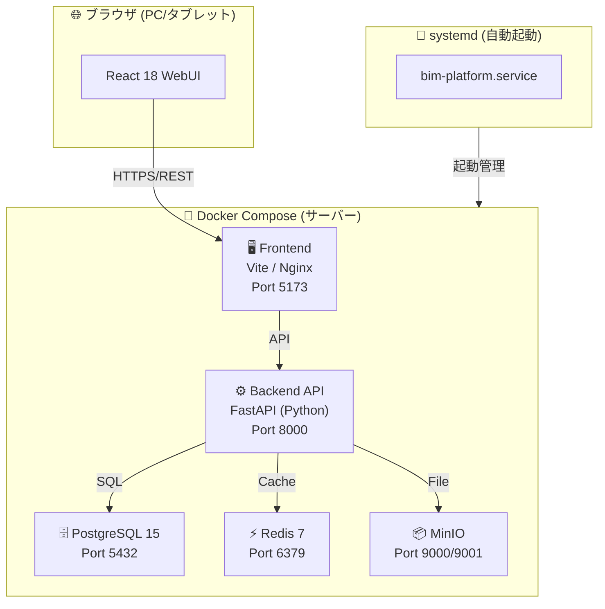

# 💻 IT 部門向け セットアップ・運用ガイド

> Open BIM 情報基盤のインストール・起動・保守を担当するITスタッフ向けの技術ガイドです。

---

## 📋 目次

- [システム構成](#-システム構成)
- [動作要件](#-動作要件)
- [インストール手順](#-インストール手順)
- [起動・停止](#-起動停止)
- [ポート一覧](#-ポート一覧)
- [ログ確認](#-ログ確認)
- [バックアップ](#-バックアップ)
- [トラブルシューティング](#-トラブルシューティング)

---

## 🏗️ システム構成



---

## ✅ 動作要件

| 項目 | 要件 |
|---|---|
| OS | Ubuntu 22.04 LTS / Debian 12 以降 |
| CPU | 2コア以上 |
| メモリ | 4GB以上（推奨8GB） |
| ディスク | 20GB以上（ファイルストレージ分別途） |
| Docker | 24.0以上 |
| Docker Compose | v2.20以上 |
| ネットワーク | LAN接続・固定IPアドレス推奨 |

---

## 📥 インストール手順

### 1. Docker のインストール

```bash
# Ubuntu/Debian
curl -fsSL https://get.docker.com | sh
sudo usermod -aG docker $USER
newgrp docker
```

### 2. リポジトリ取得

```bash
git clone https://github.com/Kensan196948G/Open-BIM-Information-Platform.git
cd Open-BIM-Information-Platform
```

### 3. 環境変数設定

```bash
cp .env.example .env
nano .env   # 各値を設定
```

**設定必須の項目:**

```env
POSTGRES_PASSWORD=強力なパスワードを設定
SECRET_KEY=ランダム64文字以上の文字列
MINIO_ROOT_PASSWORD=強力なパスワードを設定
```

### 4. systemd サービス登録（自動起動）

```bash
# デモモード（モックデータ、バックエンド不要）
sudo ./scripts/install-service.sh demo

# 本番モード（フルスタック）
sudo ./scripts/install-service.sh full
```

---

## ▶️ 起動・停止

### 手動起動

```bash
# デモモード
./scripts/start.sh demo

# フルスタック
./scripts/start.sh
```

### systemd による管理

```bash
# 状態確認
systemctl status bim-platform
systemctl status bim-platform-demo

# 起動
systemctl start bim-platform

# 停止
systemctl stop bim-platform

# 再起動
systemctl restart bim-platform
```

---

## 🔌 ポート一覧

| ポート | サービス | 用途 | 外部公開 |
|---|---|---|---|
| `3000` | デモ WebUI | モックデータUI | ✅ LAN内 |
| `5173` | 本番 WebUI | 通常操作画面 | ✅ LAN内 |
| `8000` | Backend API | REST API + SwaggerUI | ⚠️ 内部のみ推奨 |
| `5432` | PostgreSQL | データベース | ❌ 外部非公開 |
| `6379` | Redis | キャッシュ | ❌ 外部非公開 |
| `9000` | MinIO API | ファイルストレージ | ❌ 外部非公開 |
| `9001` | MinIO Console | ストレージ管理UI | ⚠️ 管理者のみ |

> ⚠️ 外部公開時は必ず nginx リバースプロキシ + TLS を設定してください

---

## 📋 ログ確認

```bash
# 全サービスのログ
docker compose logs -f

# サービス別
docker compose logs -f backend
docker compose logs -f postgres

# systemd ログ
journalctl -u bim-platform -f
```

---

## 💾 バックアップ

### データベース

```bash
# バックアップ
docker compose exec postgres pg_dump -U bim_user bim_platform > backup_$(date +%Y%m%d).sql

# リストア
docker compose exec -T postgres psql -U bim_user bim_platform < backup_YYYYMMDD.sql
```

### MinIO（ファイルストレージ）

```bash
# MinIO のデータボリュームをバックアップ
docker run --rm -v bim_minio_data:/data -v $(pwd):/backup \
  alpine tar czf /backup/minio_backup_$(date +%Y%m%d).tar.gz /data
```

---

## 🔧 トラブルシューティング

### コンテナが起動しない

```bash
docker compose ps          # 状態確認
docker compose logs        # エラーログ確認
docker compose down && docker compose up -d  # 再起動
```

### ポートが使用中

```bash
# 使用中のポートを確認
ss -tlnp | grep -E '5173|8000|3000'
```

### ディスク容量不足

```bash
# Docker の不要データ削除
docker system prune -f
docker volume prune -f   # ⚠️ データボリュームは削除しない
```

### PostgreSQL 接続エラー

```bash
docker compose exec postgres psql -U bim_user -d bim_platform -c "\conninfo"
```

---

## 📞 エスカレーション

| 問題種別 | 担当 |
|---|---|
| アプリケーションバグ | 開発チーム（GitHub Issues） |
| インフラ・ネットワーク | IT部門インフラ担当 |
| セキュリティインシデント | セキュリティ担当・即時報告 |
| 監査対応 | システム管理者 + 監査担当 |
