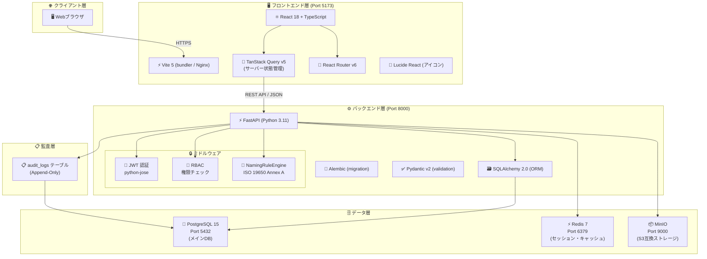
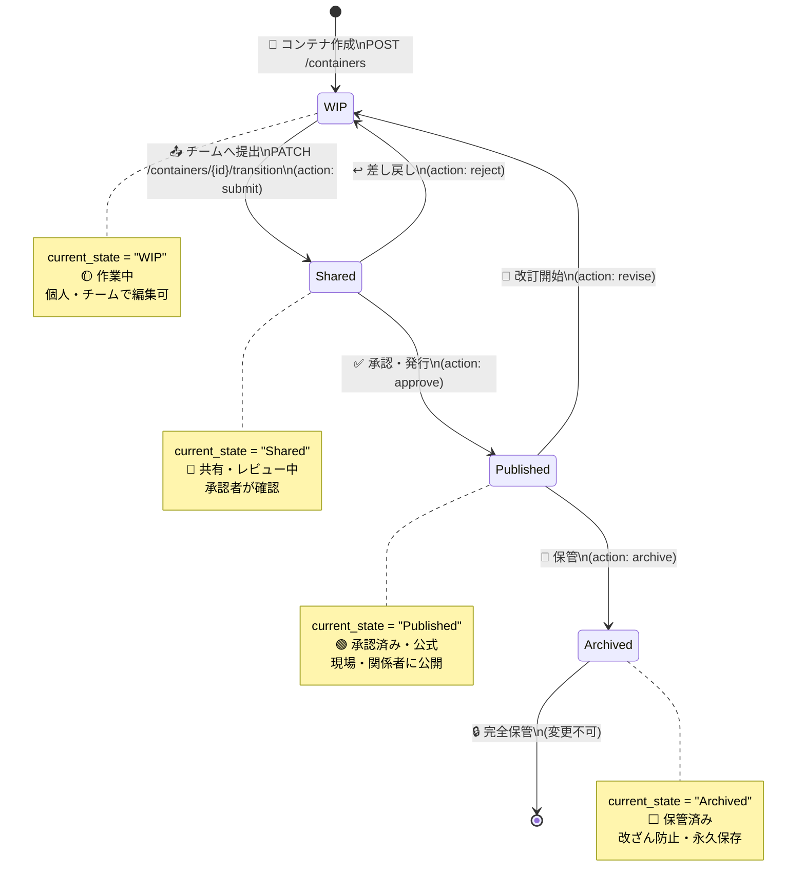
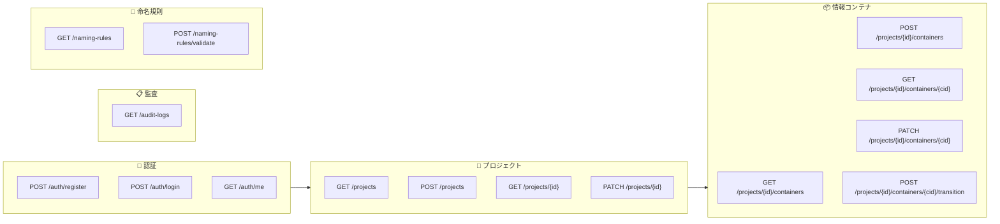
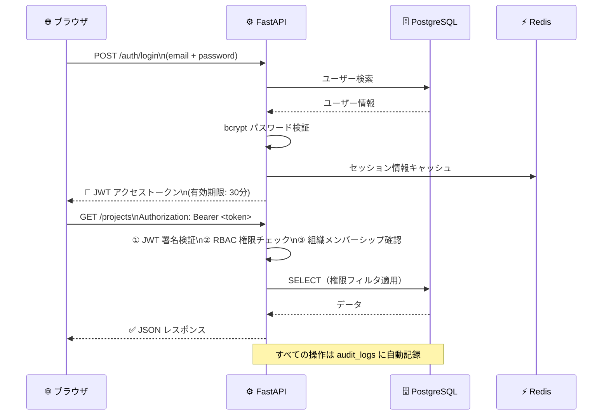
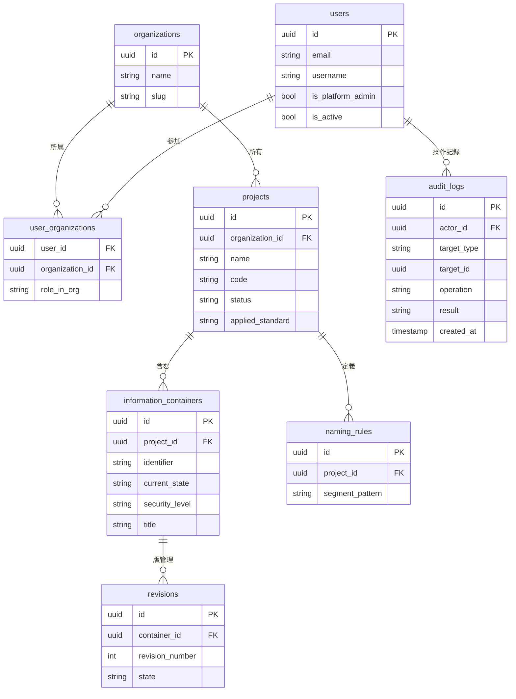
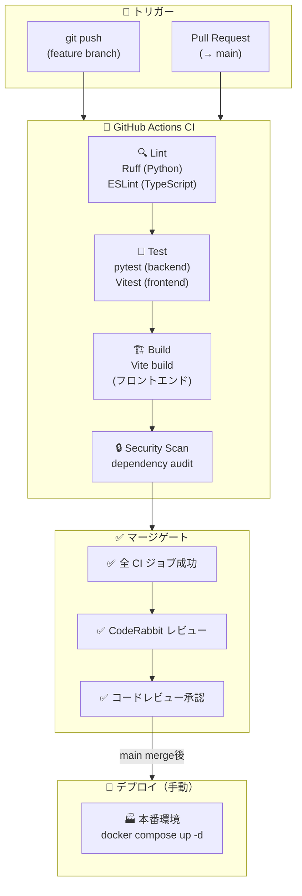
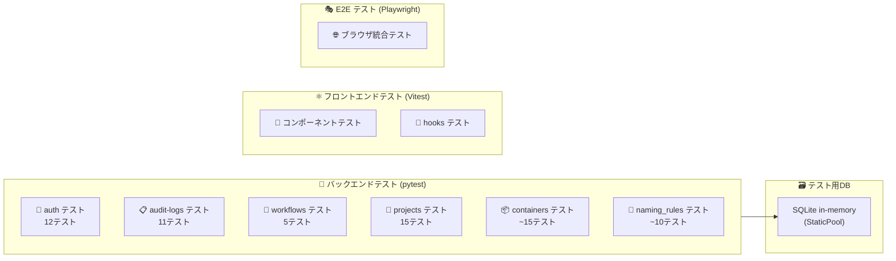

# 🔧 技術スタック詳細

> Open BIM 情報基盤の技術構成・設計判断・依存関係を記述した**エンジニア・開発担当者向け**ドキュメントです。
> ISO 19650 は「準拠支援・設計目標」であり、第三者認証は未取得です。

---

## 📋 目次

- [🏗️ アーキテクチャ全体図](#️-アーキテクチャ全体図)
- [📦 使用技術一覧](#-使用技術一覧)
- [🔄 データフロー（CDE 状態遷移）](#-データフローcde-状態遷移)
- [🔐 認証・セキュリティ設計](#-認証セキュリティ設計)
- [🗄️ データベーススキーマ概要](#️-データベーススキーマ概要)
- [📐 ISO 19650 実装マッピング](#-iso-19650-実装マッピング)
- [⚙️ CI/CD パイプライン](#️-cicd-パイプライン)
- [🚀 開発環境セットアップ](#-開発環境セットアップ)
- [🔗 関連リンク](#-関連リンク)

---

## 🏗️ アーキテクチャ全体図



---

## 📦 使用技術一覧

### 🖥️ フロントエンド

| 技術 | バージョン | 用途 |
|---|---|---|
| ⚛️ React | 18 | UI フレームワーク |
| 📘 TypeScript | 5.x | 型安全な開発 |
| ⚡ Vite | 5.x | 高速ビルドツール |
| 🔄 TanStack Query | v5 | サーバー状態管理・キャッシュ |
| 🧭 React Router | v6 | クライアントサイドルーティング |
| 🎨 Lucide React | latest | アイコンライブラリ |
| 📡 Axios | 1.x | HTTP クライアント |

### ⚙️ バックエンド

| 技術 | バージョン | 用途 |
|---|---|---|
| 🐍 Python | 3.11 | 実行環境 |
| ⚡ FastAPI | 0.110+ | REST API フレームワーク |
| 🗃️ SQLAlchemy | 2.0 | ORM（Object-Relational Mapper） |
| 🔄 Alembic | latest | DB スキーママイグレーション |
| ✅ Pydantic | v2 | データバリデーション・シリアライゼーション |
| 🔐 python-jose | latest | JWT トークン処理 |
| 🔑 passlib / bcrypt | latest | パスワードハッシュ |
| 📦 aioboto3 | latest | MinIO/S3 非同期クライアント |
| 🔌 httpx | latest | 非同期 HTTP クライアント（テスト用） |

### 🗄️ データ・インフラ

| 技術 | バージョン | 用途 |
|---|---|---|
| 🐘 PostgreSQL | 15 | リレーショナル DB（メインデータストア） |
| ⚡ Redis | 7 | セッション・キャッシュ |
| 📦 MinIO | latest | S3 互換ファイルストレージ |
| 🐳 Docker Compose | v2 | コンテナオーケストレーション |
| 🔧 systemd | — | サービス自動起動管理 |
| 🌐 Nginx | latest | リバースプロキシ・静的ファイル配信 |

### 🧪 テスト・品質

| 技術 | バージョン | 用途 |
|---|---|---|
| 🧪 pytest | 8.x | バックエンドユニット・統合テスト |
| ⚡ pytest-asyncio | latest | 非同期テストサポート |
| ⏱️ pytest-timeout | latest | テストハング防止（30秒タイムアウト） |
| 🧩 moto | latest | AWS/MinIO モック |
| ⚡ Vitest | v4 | フロントエンドユニットテスト |
| 🎭 Playwright | latest | E2E（エンドツーエンド）テスト |
| 🔍 ESLint | latest | フロントエンド静的解析 |
| 📏 Ruff | latest | Python 静的解析・フォーマット |

---

## 🔄 データフロー（CDE 状態遷移）

ISO 19650 に基づく **CDE（Common Data Environment）** の情報コンテナ状態遷移:



### API エンドポイント構成



---

## 🔐 認証・セキュリティ設計



### 🛡️ セキュリティ対策一覧

| 🛡️ 対策 | 実装 | 備考 |
|---|---|---|
| 🔑 認証 | JWT (HS256、RS256 対応準備済み) | 30分有効期限 |
| 🔐 パスワード | bcrypt ハッシュ | コスト係数 12 |
| 👥 RBAC | ロールベースアクセス制御 | `UserOrganization.role_in_org` |
| 🔒 プラットフォーム管理者 | `User.is_platform_admin` フラグ | 全組織横断アクセス |
| 📋 監査証跡 | `audit_logs` テーブル（Append-Only・DBトリガー） | J-SOX 対応は設計目標・未認証 |
| 🌐 CORS | ホワイトリスト制御 | 許可オリジンのみ |
| 💉 SQL インジェクション | SQLAlchemy ORM（パラメータバインド） | — |
| 🔒 XSS | React の自動エスケープ | — |
| 📁 ファイル検証 | SHA-256 + MIME タイプ検証 | アップロード時 |
| 🔍 IDOR 防止 | 非メンバーへの 404 返却 | 403 ではなく 404 でリソース存在を隠蔽 |

---

## 🗄️ データベーススキーマ概要



---

## 📐 ISO 19650 実装マッピング

| 📐 ISO 19650 要件 | 🔧 実装 | 📁 コード位置 |
|---|---|---|
| CDE 状態管理 | `containers.current_state` (WIP/Shared/Published/Archived) | `app/models/container.py` |
| 命名規則 (Annex A) | `NamingRuleEngine` — 7セグメント検証 | `app/services/naming_rule.py` |
| 情報セキュリティ区分 | `security_level` (public/limited/confidential/restricted) | `app/models/container.py` |
| 改訂管理 | `revisions` テーブル + 状態履歴 | `app/models/revision.py` |
| 役割と責任 | `rbac_roles` + `UserOrganization.role_in_org` | `app/models/user.py` |
| 監査証跡 | `audit_logs` テーブル (actor/target/operation/result) | `app/models/audit_log.py` |
| 情報管理責任者 | `is_platform_admin` フラグ | `app/models/user.py` |

---

## ⚙️ CI/CD パイプライン



### テスト構成



---

## 🚀 開発環境セットアップ

### バックエンド

```bash
# 1. 仮想環境作成
cd backend
python -m venv venv && source venv/bin/activate

# 2. 依存パッケージインストール
pip install -r requirements.txt
pip install -r requirements-dev.txt  # テスト依存含む

# 3. 環境変数設定
cp .env.example .env

# 4. 開発サーバー起動
uvicorn app.main:app --reload --port 8000

# 5. テスト実行
pytest backend/tests/ -v --timeout=30
```

### フロントエンド

```bash
# 1. 依存パッケージインストール
cd frontend
npm install

# 2. 環境変数設定
cp .env.example .env.local

# 3. 開発サーバー起動（バックエンド連携）
npm run dev   # http://localhost:5173

# 4. モックモード（バックエンド不要）
VITE_MOCK_MODE=true npm run dev

# 5. テスト実行
npm test
```

### Docker Compose（フルスタック起動）

```bash
# 全サービス起動
docker compose up -d

# ログ確認
docker compose logs -f backend

# マイグレーション実行
docker compose exec backend alembic upgrade head
```

---

## 🔗 関連リンク

| ドキュメント | 対象 |
|---|---|
| [📖 README（非エンジニア向け）](../README.md) | 現場・経営・監査 |
| [💻 IT セットアップガイド](IT_SETUP.md) | IT 部門スタッフ |
| [🏗️ アーキテクチャ設計書](ARCHITECTURE.md) | BIM 管理者・設計担当 |
| [🌐 API ドキュメント](http://localhost:8000/docs) | 開発者（起動後） |
| [📦 GitHub リポジトリ](https://github.com/Kensan196948G/Open-BIM-Information-Platform) | 全員 |

---

*⚙️ 技術的な質問・バグ報告は [GitHub Issues](https://github.com/Kensan196948G/Open-BIM-Information-Platform/issues) へ*
