# ⚙️ 技術スタック詳細

> Open BIM 情報基盤の技術構成・設計判断・依存関係を記述した **開発者・エンジニア向け** ドキュメントです。
> 非エンジニア向けの概要は → [README.md](../README.md) | IT部門向けセットアップは → [IT_SETUP.md](IT_SETUP.md)

---

## 📋 目次

- [アーキテクチャ全体図](#-アーキテクチャ全体図)
- [使用技術一覧](#-使用技術一覧)
- [フロントエンド構成](#-フロントエンド構成)
- [バックエンド構成](#-バックエンド構成)
- [データベーススキーマ](#-データベーススキーマ)
- [API エンドポイント一覧](#-api-エンドポイント一覧)
- [認証・セキュリティ設計](#-認証セキュリティ設計)
- [ISO 19650 実装マッピング](#-iso-19650-実装マッピング)
- [モックモード設計](#-モックモード設計)
- [CI/CD パイプライン](#-cicd-パイプライン)
- [開発環境セットアップ](#-開発環境セットアップ)

---

## 🏗️ アーキテクチャ全体図

### 本番モード（フルスタック）

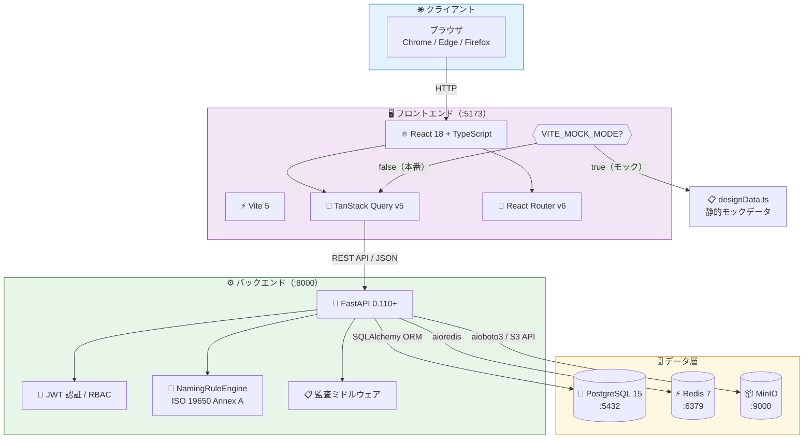

### デモモード（フロントエンドのみ）

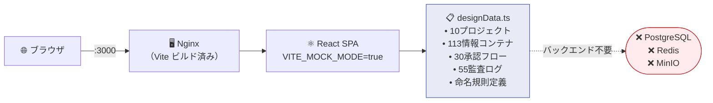

---

## 📦 使用技術一覧

### フロントエンド

| 技術              | バージョン | 用途                                      |
| ----------------- | ---------- | ----------------------------------------- |
| ⚛️ React          | 18         | UI コンポーネントフレームワーク           |
| 📘 TypeScript     | 5.x        | 型安全開発・コンパイル時エラー検出        |
| ⚡ Vite           | 5.x        | 高速ビルドツール（HMR 対応）              |
| 🔄 TanStack Query | v5         | サーバー状態管理・キャッシュ・再フェッチ  |
| 🧭 React Router   | v6         | クライアントサイドルーティング            |
| 🎨 Lucide React   | latest     | アイコンライブラリ（SVG）                 |
| 📡 Axios          | 1.x        | HTTP クライアント（インターセプター対応） |
| 🎭 Vitest         | v4         | ユニット・コンポーネントテスト            |
| 🎭 Playwright     | latest     | E2E テスト                                |

### バックエンド

| 技術              | バージョン | 用途                                       |
| ----------------- | ---------- | ------------------------------------------ |
| 🐍 Python         | 3.11       | 実行環境                                   |
| ⚡ FastAPI        | 0.110+     | 非同期 REST API フレームワーク             |
| 🗃️ SQLAlchemy     | 2.0        | ORM（非同期対応 async session）            |
| 🔄 Alembic        | latest     | DB スキーママイグレーション                |
| ✅ Pydantic       | v2         | リクエスト/レスポンスバリデーション        |
| 🔐 python-jose    | latest     | JWT トークン生成・検証                     |
| 🔑 passlib        | latest     | パスワードハッシュ（bcrypt）               |
| 📦 aioboto3       | latest     | MinIO / S3 非同期クライアント              |
| 🔴 aioredis       | latest     | Redis 非同期クライアント                   |
| 🧪 pytest         | 7.x+       | テストフレームワーク                       |
| 🧪 pytest-asyncio | latest     | 非同期テスト対応                           |
| ⏱️ pytest-timeout | latest     | テストタイムアウト制御                     |
| 🧪 moto           | latest     | AWS/S3 モックライブラリ                    |
| 📏 Ruff           | latest     | 静的解析・フォーマット（Black/isort 代替） |

### データ・インフラ

| 技術              | バージョン | 用途                               |
| ----------------- | ---------- | ---------------------------------- |
| 🐘 PostgreSQL     | 15         | メインリレーショナル DB            |
| ⚡ Redis          | 7          | セッション・キャッシュ・レート制限 |
| 📦 MinIO          | latest     | S3 互換ファイルストレージ          |
| 🐳 Docker         | 24.0+      | コンテナランタイム                 |
| 🐳 Docker Compose | v2.20+     | マルチコンテナオーケストレーション |
| 🔧 Nginx          | latest     | 静的ファイル配信（デモモード）     |
| ⚙️ systemd        | -          | OS 起動時サービス自動起動          |

---

## 🖥️ フロントエンド構成

### コンポーネントツリー

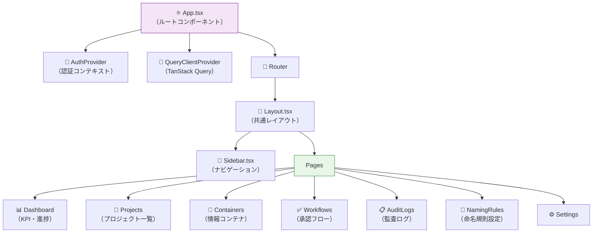

### モックモード データフロー

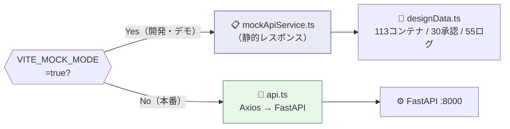

### 主要ファイル構成

```
frontend/src/
├── components/          # 再利用可能UIコンポーネント
│   ├── ui/              # ボタン・モーダル・テーブル等
│   └── domain/          # BIM固有コンポーネント
├── pages/               # ルートごとのページコンポーネント
├── lib/
│   ├── designData.ts    # モックデータ定義（全エンティティ）
│   ├── api.ts           # Axios インスタンス + インターセプター
│   └── mockApiService.ts # モックAPI実装
├── hooks/               # カスタムフック（useProjects 等）
├── types/               # TypeScript 型定義
└── contexts/            # React Context（Auth 等）
```

---

## ⚙️ バックエンド構成

### レイヤーアーキテクチャ

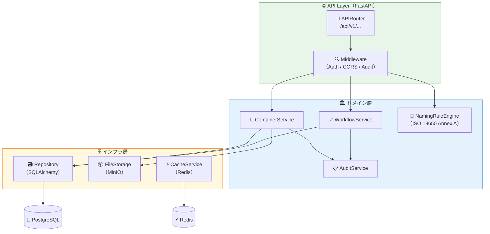

### 主要ファイル構成

```
backend/app/
├── main.py              # FastAPI アプリ初期化 / ミドルウェア登録
├── api/v1/              # APIルーター
│   ├── auth.py          # 認証 (login / refresh / logout)
│   ├── projects.py      # プロジェクト CRUD
│   ├── containers.py    # 情報コンテナ CRUD + 状態遷移
│   ├── workflows.py     # 承認フロー管理
│   ├── audit_logs.py    # 監査ログ取得
│   └── naming_rules.py  # 命名規則 CRUD + 検証
├── models/              # SQLAlchemy ORM モデル
├── schemas/             # Pydantic スキーマ（Request/Response）
├── services/            # ビジネスロジック
│   └── naming_rule_engine.py  # ISO 19650 Annex A 検証
├── core/
│   ├── security.py      # JWT / bcrypt
│   └── config.py        # 環境変数設定
└── db/
    └── session.py       # AsyncSession ファクトリ
```

---

## 🗄️ データベーススキーマ

### ER ダイアグラム

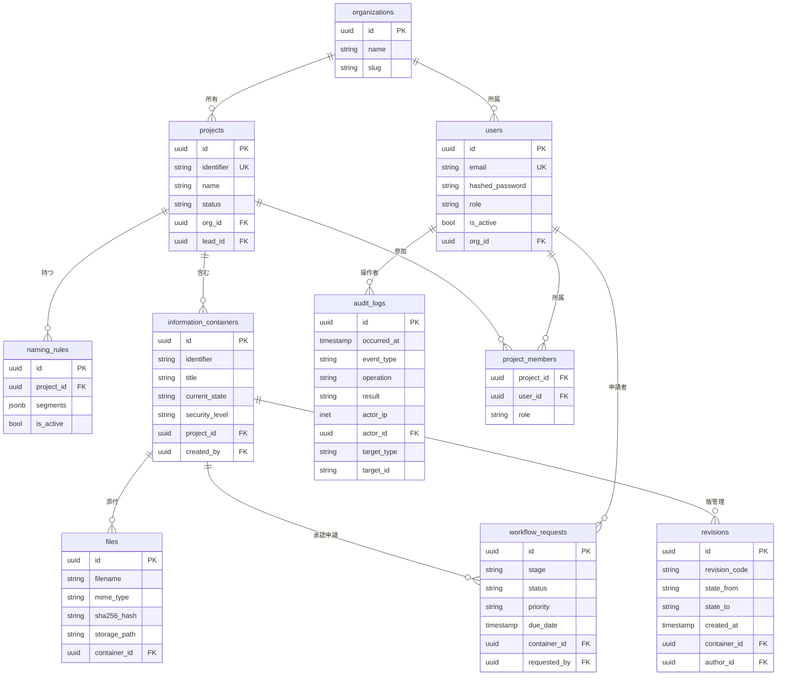

---

## 📡 API エンドポイント一覧

### 主要エンドポイントマップ

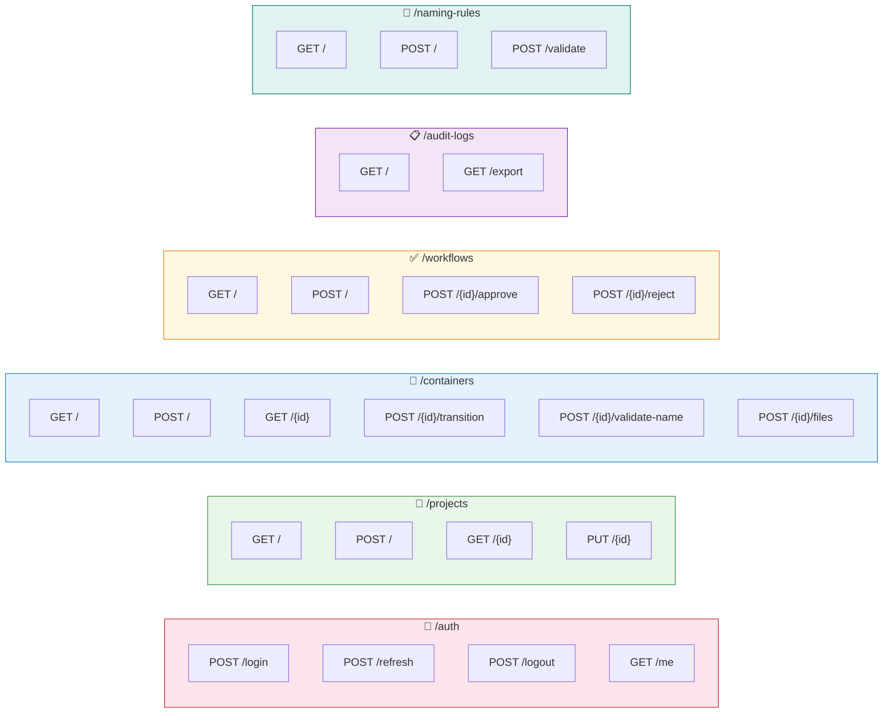

### エンドポイント詳細

| エンドポイント                          | メソッド | 認証    | 説明                                  |
| --------------------------------------- | -------- | ------- | ------------------------------------- |
| `/api/v1/auth/login`                    | POST     | ❌ 不要 | メール/パスワードでログイン、JWT 返却 |
| `/api/v1/auth/me`                       | GET      | ✅ JWT  | ログイン中ユーザー情報                |
| `/api/v1/projects`                      | GET      | ✅ JWT  | プロジェクト一覧（権限フィルタ）      |
| `/api/v1/projects/{id}`                 | GET      | ✅ JWT  | プロジェクト詳細                      |
| `/api/v1/containers`                    | GET      | ✅ JWT  | 情報コンテナ一覧                      |
| `/api/v1/containers/{id}/transition`    | POST     | ✅ JWT  | CDE状態遷移（WIP→Shared等）           |
| `/api/v1/containers/{id}/validate-name` | POST     | ✅ JWT  | ISO 19650 命名規則検証                |
| `/api/v1/workflows`                     | GET      | ✅ JWT  | 承認フロー一覧                        |
| `/api/v1/workflows/{id}/approve`        | POST     | ✅ JWT  | 承認（承認者ロール必須）              |
| `/api/v1/workflows/{id}/reject`         | POST     | ✅ JWT  | 差し戻し（コメント必須）              |
| `/api/v1/audit-logs`                    | GET      | ✅ JWT  | 監査ログ一覧（管理者のみ）            |
| `/api/v1/naming-rules/validate`         | POST     | ✅ JWT  | 命名規則バリデーション単体実行        |

---

## 🔐 認証・セキュリティ設計

### 認証フロー（JWT）

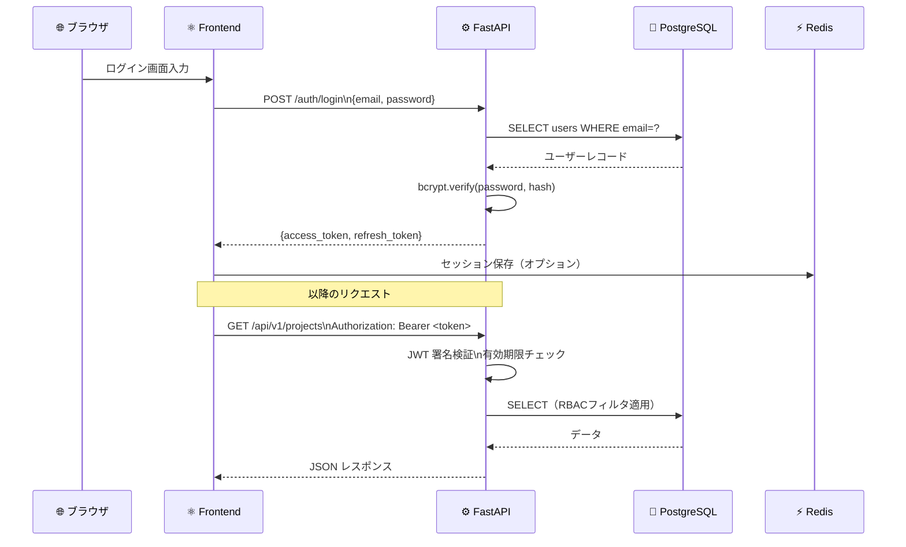

### セキュリティ対策一覧

| カテゴリ                | 対策                   | 実装詳細                                            |
| ----------------------- | ---------------------- | --------------------------------------------------- |
| 🔐 認証                 | JWT Bearer トークン    | python-jose / HS256（RS256 対応準備済み）           |
| 🔑 パスワード           | bcrypt ハッシュ        | passlib[bcrypt] / work factor 12                    |
| 🛡️ 認可                 | RBAC                   | ロール: admin / manager / reviewer / member         |
| 📋 監査                 | 全操作記録             | audit_logs テーブル（actor / target / IP / result） |
| 🌐 CORS                 | ホワイトリスト         | 許可オリジンを環境変数で管理                        |
| 💉 SQL インジェクション | ORM パラメータバインド | SQLAlchemy 2.0 async                                |
| 🛡️ XSS                  | 自動エスケープ         | React の JSX エスケープ                             |
| 📁 ファイル検証         | SHA-256 + MIME         | アップロード時に整合性検証                          |
| 🔒 機密区分             | 4段階 security_level   | public / limited / confidential / restricted        |

---

## 📐 ISO 19650 実装マッピング

### CDE 状態遷移

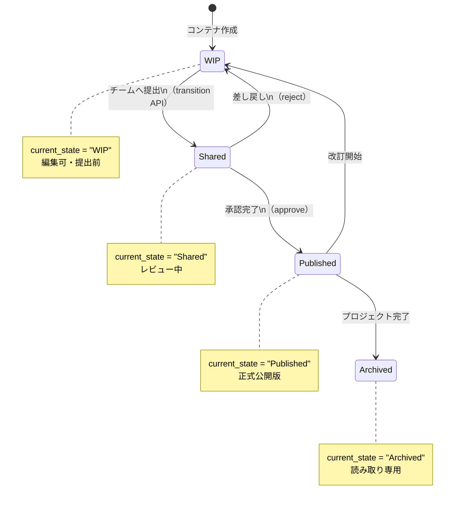

### ISO 19650 要件マッピング表

| ISO 19650 要件       | 実装クラス/テーブル              | 説明                                                   |
| -------------------- | -------------------------------- | ------------------------------------------------------ |
| CDE 状態管理         | `containers.current_state`       | WIP/Shared/Published/Archived の4状態                  |
| 命名規則 Annex A     | `NamingRuleEngine`               | 7セグメント検証（PROJECT-ORG-VOL-LEVEL-TYPE-ROLE-NUM） |
| 情報セキュリティ区分 | `containers.security_level`      | 4段階（public/limited/confidential/restricted）        |
| 改訂管理             | `revisions` テーブル             | 全状態変化を履歴として保存                             |
| 役割と責任           | `rbac_roles` + `project_members` | プロジェクト単位のロール付与                           |
| 監査証跡             | `audit_logs` テーブル            | actor/target/operation/result/IP を記録                |
| EIR / BEP 管理       | `projects.metadata` (JSONB)      | 情報要求・BIM実行計画のメタデータ管理                  |

### 命名規則 7セグメント構造（ISO 19650 Annex A）

```
{PROJECT} - {ORIGINATOR} - {VOLUME} - {LEVEL} - {TYPE} - {ROLE} - {NUMBER}
    TKO   -     CVL      -   ZZ    -   ZZ    -   DR   -    A   -  0001
```

| セグメント | 例            | 説明                             |
| ---------- | ------------- | -------------------------------- |
| PROJECT    | TKO, HKR, HND | プロジェクト識別子               |
| ORIGINATOR | CVL, STR, MEP | 担当組織・専門分野               |
| VOLUME     | ZZ, TN1, BRG  | ボリューム/エリア区分            |
| LEVEL      | ZZ, B1, RF    | フロア/レベル                    |
| TYPE       | DR, MD, SP    | 情報タイプ（図面/モデル/仕様書） |
| ROLE       | A, C, E       | 作成者ロール                     |
| NUMBER     | 0001〜9999    | 連番                             |

---

## 🎭 モックモード設計

### 環境変数切り替え

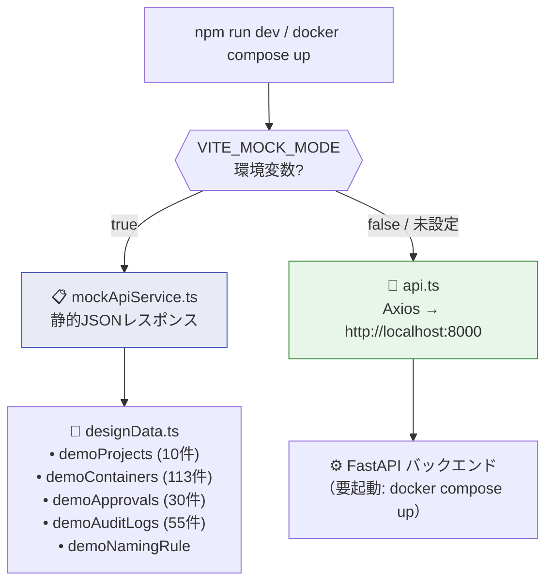

### モックデータ内訳

| データ種別      | 件数                        | ファイル                        |
| --------------- | --------------------------- | ------------------------------- |
| 📁 プロジェクト | 10件                        | `designData.ts: demoProjects`   |
| 📄 情報コンテナ | 113件                       | `designData.ts: demoContainers` |
| ✅ 承認フロー   | 30件                        | `designData.ts: demoApprovals`  |
| 📋 監査ログ     | 55件                        | `designData.ts: demoAuditLogs`  |
| 📛 命名規則     | 1定義（10プロジェクト対応） | `designData.ts: demoNamingRule` |

---

## 🔄 CI/CD パイプライン

### GitHub Actions ワークフロー

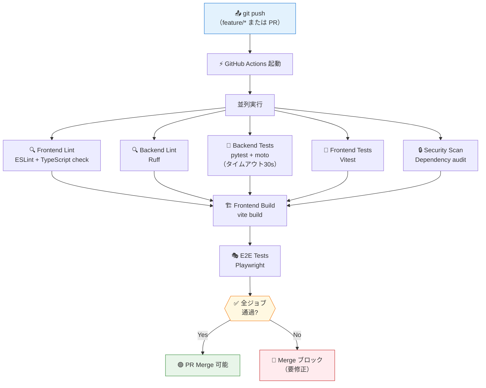

### CI ジョブ詳細

| ジョブ            | ツール                         | 対象                       | 所要時間目安 |
| ----------------- | ------------------------------ | -------------------------- | ------------ |
| 🔍 Frontend Lint  | ESLint + tsc --noEmit          | `frontend/src/**`          | ~30秒        |
| 🔍 Backend Lint   | Ruff                           | `backend/app/**`           | ~10秒        |
| 🧪 Backend Tests  | pytest + moto + pytest-timeout | `backend/tests/**`         | ~60秒        |
| 🧪 Frontend Tests | Vitest                         | `frontend/src/**/*.test.*` | ~30秒        |
| 🔒 Security Scan  | npm audit + pip-audit          | 依存パッケージ             | ~20秒        |
| 🏗️ Build          | vite build                     | `frontend/`                | ~45秒        |
| 🎭 E2E Tests      | Playwright                     | `e2e/**`                   | ~120秒       |

---

## 🚀 開発環境セットアップ

### バックエンド起動

```bash
cd backend
python -m venv venv
source venv/bin/activate          # Windows: venv\Scripts\activate
pip install -r requirements.txt

# PostgreSQL + Redis が必要（Docker Compose 推奨）
docker compose up postgres redis -d

# マイグレーション実行
alembic upgrade head

# 開発サーバー起動
uvicorn app.main:app --reload --port 8000
# → http://localhost:8000/docs  (Swagger UI)
```

### フロントエンド起動

```bash
cd frontend
npm install

# 本番モード（バックエンド接続）
cp .env.example .env.local
# .env.local: VITE_API_BASE_URL=http://localhost:8000
npm run dev   # → http://localhost:5173

# モックモード（バックエンド不要）
VITE_MOCK_MODE=true npm run dev
```

### 全スタック起動（推奨）

```bash
# フルスタック
./scripts/start.sh

# デモモード（バックエンド不要・即起動）
./scripts/start.sh demo
```

### テスト実行

```bash
# バックエンドテスト
cd backend
pytest -v --timeout=30

# フロントエンドテスト
cd frontend
npm run test

# E2E テスト
cd e2e
npx playwright test
```

---

## 🔗 関連ドキュメント

| 対象者                     | ドキュメント                                                                 |
| -------------------------- | ---------------------------------------------------------------------------- |
| 👔 非エンジニア・経営者    | [📋 README.md（概要）](../README.md)                                         |
| 💻 IT 部門・システム管理者 | [📘 IT_SETUP.md（セットアップ）](IT_SETUP.md)                                |
| 📐 BIM 管理者・技術者      | [📐 BIM_GUIDE.md（ISO 19650 ガイド）](BIM_GUIDE.md)                          |
| 🌐 API リファレンス        | [Swagger UI](http://localhost:8000/docs)（起動後）                           |
| 📦 GitHub                  | [リポジトリ](https://github.com/Kensan196948G/Open-BIM-Information-Platform) |

---

_← [README.md（概要）](../README.md) | [📘 IT_SETUP.md（IT セットアップ）](IT_SETUP.md) →_
