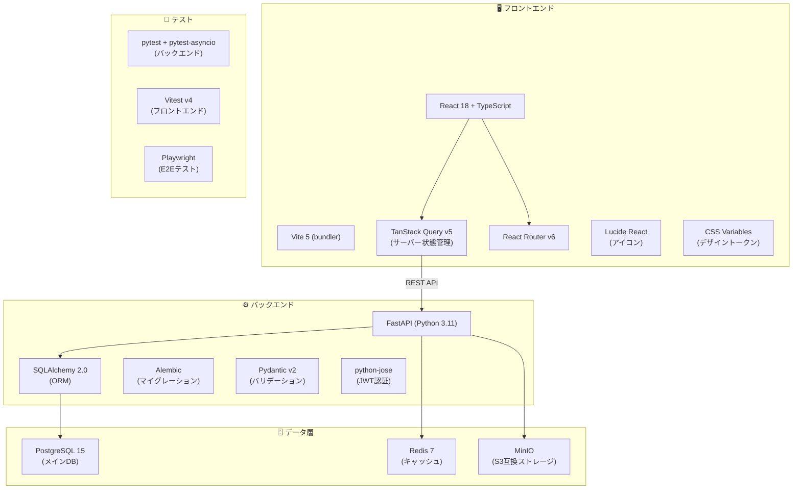
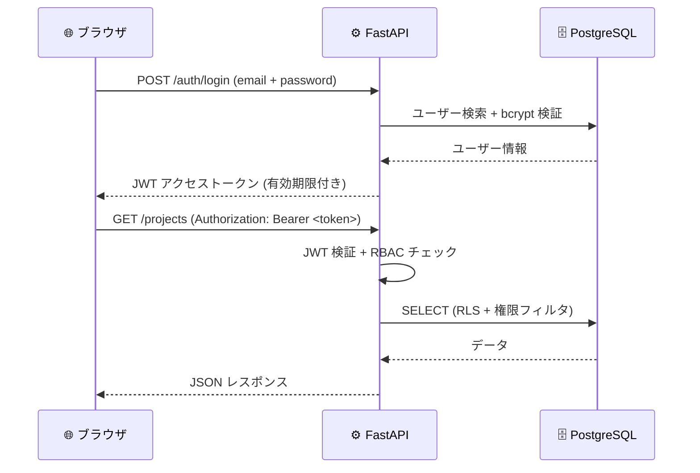
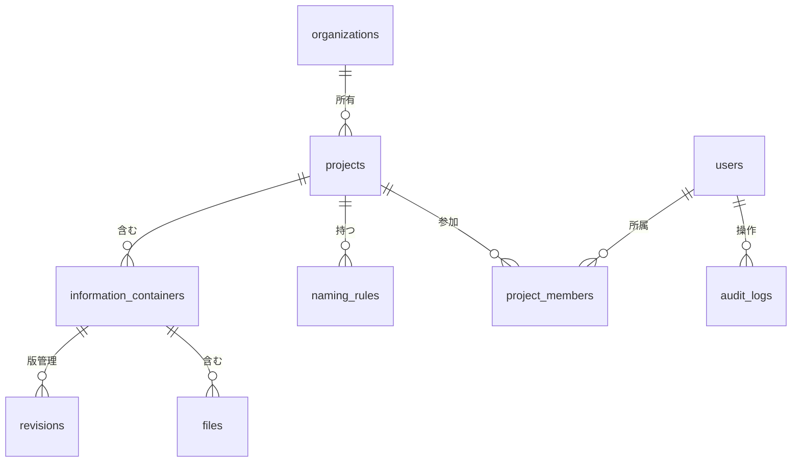

# 🔧 技術スタック詳細

> Open BIM 情報基盤の技術構成・設計判断・依存関係を記述した開発者向けドキュメントです。

---

## 🏗️ アーキテクチャ全体図



---

## 📦 使用技術一覧

### フロントエンド

| 技術 | バージョン | 用途 |
|---|---|---|
| ⚛️ React | 18 | UIフレームワーク |
| 📘 TypeScript | 5.x | 型安全な開発 |
| ⚡ Vite | 5.x | 高速ビルドツール |
| 🔄 TanStack Query | v5 | サーバー状態管理・キャッシュ |
| 🧭 React Router | v6 | クライアントサイドルーティング |
| 🎨 Lucide React | latest | アイコンライブラリ |
| 📡 Axios | 1.x | HTTP クライアント |

### バックエンド

| 技術 | バージョン | 用途 |
|---|---|---|
| 🐍 Python | 3.11 | 実行環境 |
| ⚡ FastAPI | 0.110+ | REST API フレームワーク |
| 🗃️ SQLAlchemy | 2.0 | ORM（Object-Relational Mapper） |
| 🔄 Alembic | latest | DBスキーママイグレーション |
| ✅ Pydantic | v2 | データバリデーション |
| 🔐 python-jose | latest | JWT トークン処理 |
| 🔑 passlib | latest | パスワードハッシュ（bcrypt） |
| 📦 aioboto3 | latest | MinIO/S3 非同期クライアント |

### データ・インフラ

| 技術 | バージョン | 用途 |
|---|---|---|
| 🐘 PostgreSQL | 15 | リレーショナルDB |
| ⚡ Redis | 7 | セッション・キャッシュ |
| 📦 MinIO | latest | S3互換ファイルストレージ |
| 🐳 Docker Compose | v2 | コンテナオーケストレーション |
| 🔧 systemd | - | サービス自動起動管理 |

### テスト・品質

| 技術 | 用途 |
|---|---|
| 🧪 pytest + pytest-asyncio | バックエンドユニット/統合テスト |
| ⚡ Vitest v4 | フロントエンドユニットテスト |
| 🎭 Playwright | E2E（エンドツーエンド）テスト |
| 🔍 ESLint | フロントエンド静的解析 |
| 📏 Ruff | Python 静的解析・フォーマット |

---

## 🔐 セキュリティ設計



### セキュリティ対策

| 対策 | 実装 |
|---|---|
| 認証 | JWT (RS256 対応準備済み) |
| パスワード | bcrypt ハッシュ |
| RBAC | ロールベースアクセス制御 |
| 監査証跡 | 全操作を audit_logs テーブルに記録 |
| CORS | ホワイトリスト制御 |
| SQL インジェクション | SQLAlchemy ORM（パラメータバインド） |
| XSS | React の自動エスケープ |
| ファイル検証 | SHA-256 ハッシュ + MIMEタイプ検証 |

---

## 📐 ISO 19650 実装マッピング

| ISO 19650 要件 | 実装 |
|---|---|
| CDE 状態管理 | `containers.current_state` (WIP/Shared/Published/Archived) |
| 命名規則 (Annex A) | `NamingRuleEngine` — 7セグメント検証 |
| 情報セキュリティ区分 | `security_level` (public/limited/confidential/restricted) |
| 改訂管理 | `revisions` テーブル + 状態履歴 |
| 役割と責任 | `rbac_roles` + `project_members` |
| 監査証跡 | `audit_logs` テーブル (actor/target/operation/result) |

---

## 🗄️ データベーススキーマ概要



---

## 🚀 開発環境セットアップ

```bash
# 1. バックエンド
cd backend
python -m venv venv && source venv/bin/activate
pip install -r requirements.txt
uvicorn app.main:app --reload --port 8000

# 2. フロントエンド
cd frontend
npm install
cp .env.example .env.local
npm run dev   # http://localhost:5173

# 3. モックモードで起動（バックエンド不要）
VITE_MOCK_MODE=true npm run dev
```

---

## 🔗 関連リンク

- [README（非エンジニア向け）](../README.md)
- [IT セットアップガイド](IT_SETUP.md)
- [API ドキュメント](http://localhost:8000/docs)（起動後）
- [GitHub リポジトリ](https://github.com/Kensan196948G/Open-BIM-Information-Platform)
